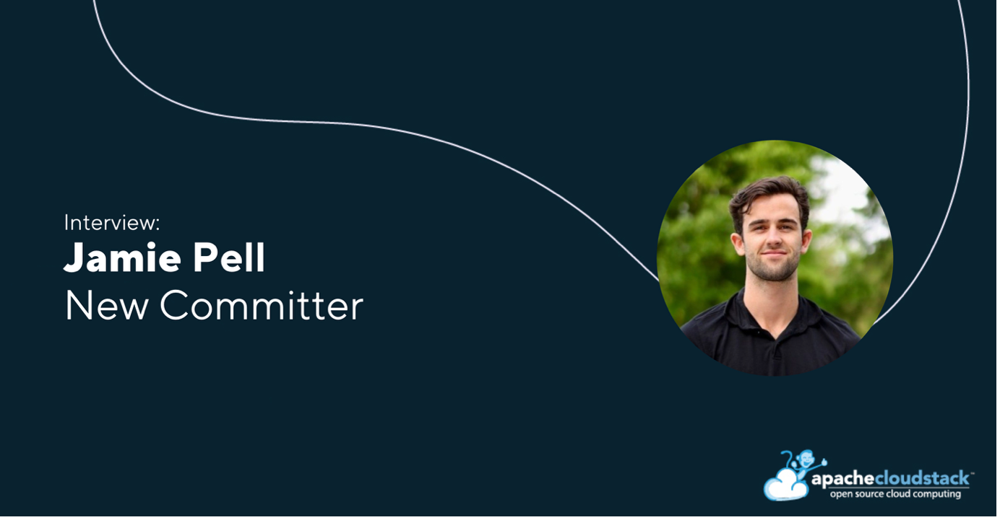

[Jamie Pell](https://www.linkedin.com/in/jamie-pell/) has been
appointed as a Committer to the CloudStack project. In this written
interview, he shares insights into his contributions beyond code,
offers advice for newcomers looking to get involved, discusses the
value of companies sharing their CloudStack use cases, and more.

<!-- truncate -->

##### Introduce yourself in a few words and what your job role/company is

Hi, I'm Jamie. I work as the Digital Marketing Lead at
[ShapeBlue](https://www.shapeblue.com/), the world's largest
integrator of [Apache CloudStack technologies and a well-known name
within the CloudStack community. In my role, I lead a range of digital
initiatives including content creation (both video and written),
social media strategy, web design and development, SEO, and end-to-end
digital marketing campaigns. I’m also very involved in supporting and
promoting the wider CloudStack community, applying the same expertise
to help drive awareness and growth to the project.

##### What are some key projects and developments you have worked on and are currently working on?

A project which I finished earlier this year was the new [CloudStack
Collaboration Conference](https://www.cloudstackcollab.org/) website,
leading the project end to end. The goal was to deliver a modern,
user-friendly site that better reflects the scale and significance of
the conference, the most important event in the CloudStack
calendar. Updating the design was especially important, as the event
continues to grow in size and interest each year, and the website
serves as the first point of contact for attendees, sponsors, and the
wider community.

Much of my current work is focused on upcoming events, such as this
year’s [CloudStack Collaboration
Conference](https://www.cloudstackcollab.org/). My responsibilities
cover the full event cycle. From promoting registrations and the call
for presentations, securing sponsorships, onboarding new sponsors and
coordinating on-site arrangements to ensure everything runs smoothly
throughout the event.

##### Beyond writing code, what other forms of contribution would most benefit the CloudStack project?

One of the most noticeable needs in the CloudStack community today is
ensuring that the project website is consistently updated to reflect
the pace of technological progress. The website serves as the first
point of contact for many potential users, contributors, and
decision-makers. By keeping it aligned with the latest features,
trends, and advancements in CloudStack, we not only provide accurate
information but also demonstrate that the project is vibrant, active,
and continually evolving.

I think refreshed website content and more regular solutions briefs &
case studies all help inform and attract both adopters and
contributors. When companies share their CloudStack use cases, the
entire ecosystem benefits. Each story exposes the community to
different infrastructures, environments, and real-world challenges.

##### How do companies benefit when sharing their Use Case?

By sharing their approach, companies build a reputation as a trusted
reference point in the community, while their colleagues involved in
the work are often seen as thought leaders, providing real-world
insights that others can learn from. Sharing use cases also provides a
platform to reinforce important principles such as avoiding vendor
lock-in, achieving cost efficiency, ensuring scalability, enabling
flexibility, and the list goes on.

##### What is your approach to working with a community that’s spread across the globe?

I collaborate with the community primarily through [the mailing
lists](https://cloudstack.apache.org/mailing-lists/), which are the
central communication channels for Apache CloudStack. That’s where
most of the discussions take place, and it’s a great way to stay
connected with contributors across the world. I also engage a lot
through community events, which provide the chance to meet people
face-to-face, share ideas, and strengthen relationships. Many
contributors and project members are also very active in GitHub
discussions, though I personally participate less there since my focus
is more on the marketing and community outreach side of the project.

