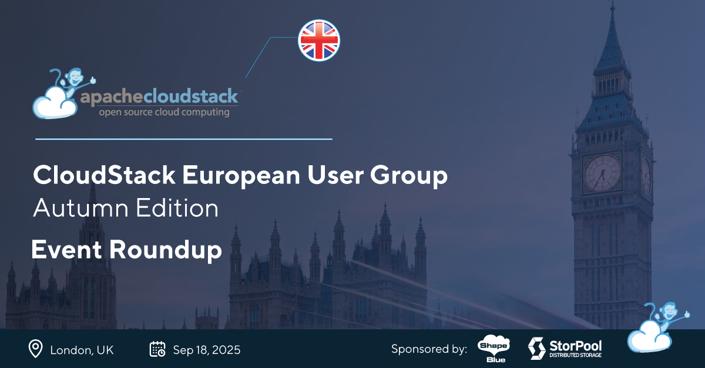
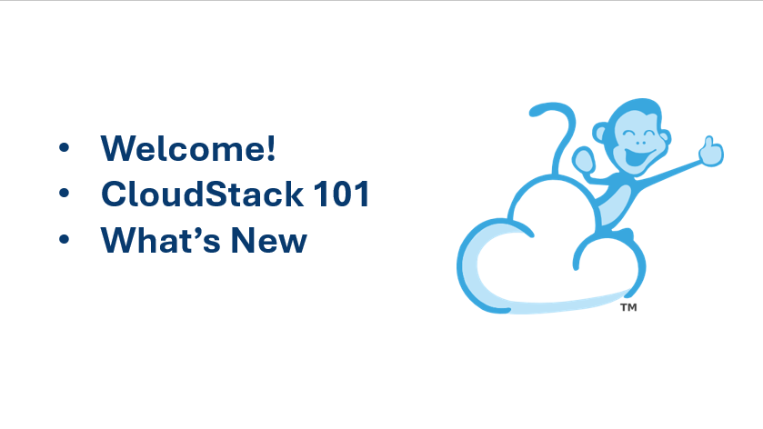
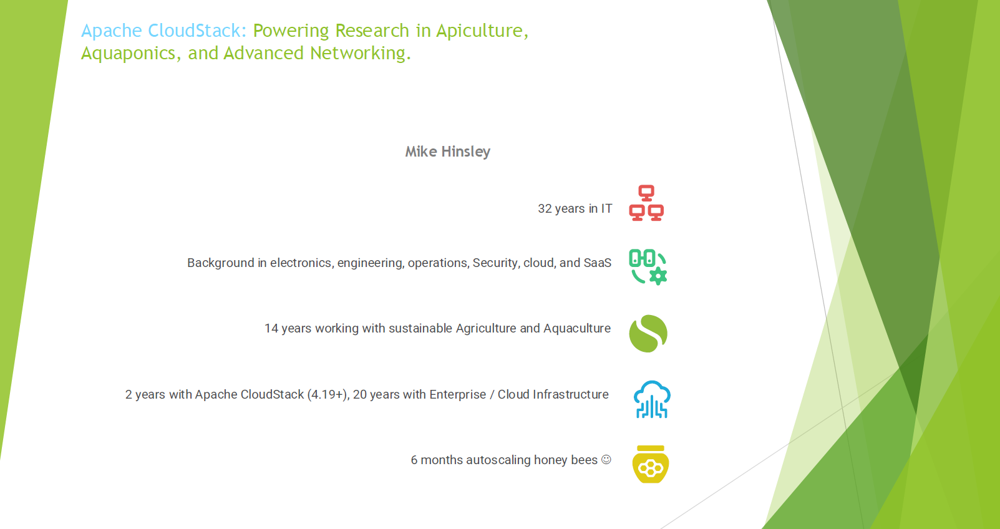
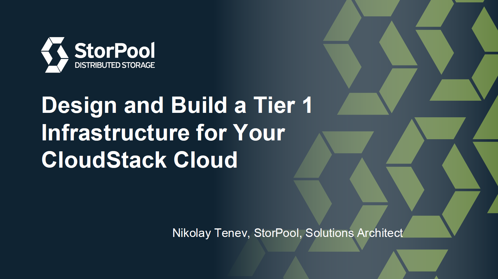
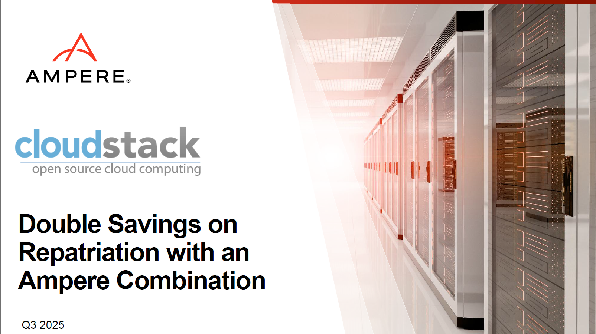
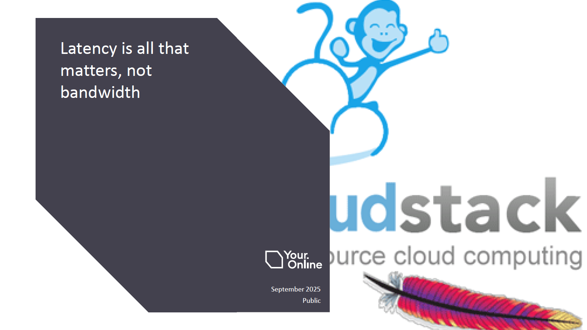

The recent CloudStack European User Group in London gathered cloud
builders, researchers, and technology enthusiasts to explore the
latest developments in Apache CloudStack and share practical
experiences from the field. With a full agenda of technical talks and
community discussions, the event once again highlighted the strength
of collaboration in the CloudStack ecosystem.

<!-- truncate -->

  <a class="button button--primary" href="https://www.youtube.com/playlist?list=PLnIKk7GjgFlYq0GjNqEhYt6UhQT3lH3YB" target="_blank">Watch Session Recordings</a>

 

Below you can find the sessions slides, abstracts, as well as
speaker’s social links in case you would like to connect and have any
questions about their session!

**Access each session's slides by clicking onto the presentation graphic.**

##### Welcome, Community, and CloudStack 101 - [Steve Roles](https://www.linkedin.com/in/steveroles/), [ShapeBlue](https://www.linkedin.com/company/shapeblue)

The day opened with an introduction to the CloudStack community from
Steve Roles (ShapeBlue) and an overview of the platform’s core
features, architecture, and use cases. Attendees also heard about the
latest releases and new functionality.

##### Apache CloudStack: Powering Research in Apiculture, Aquaponics, and Advanced Networking - Mike Hinsley, GYOCYO

Mike Hinsley (GYOCYO) showcased how CloudStack powers innovative
research environments, from IoT systems for bee colony monitoring to
automated aquaponics setups and complex network testbeds. His session
demonstrated how open-source infrastructure enables cost-effective,
scalable research projects.

##### Design and Build a Tier 1 Infrastructure for Your CloudStack Cloud - [Nikolay Tenev](https://www.linkedin.com/in/ntenev/), [StorPool](https://www.linkedin.com/company/storpool/)

Nikolay Tenev (StorPool) discussed how to build Tier 1 infrastructure
for CloudStack clouds, focusing on delivering high uptime,
performance, scalability, disaster recovery, and cost efficiency. His
session highlighted how the right infrastructure enables service
providers to meet demanding SLAs while simplifying operations.

##### Double the Savings on Repatriation with an Ampere Combination – [Pete Logan](https://www.linkedin.com/in/petelogan/), [Ampere](https://www.linkedin.com/company/amperecomp/)

Pete Logan (Ampere) explained how moving workloads from hyperscalers
to Ampere CPU-based systems with CloudStack can reduce TCO, improve
efficiency, and provide a smooth path for Arm-based workloads.

##### Latency Is All That Matters, Not Bandwidth – [Wido den Hollander](https://www.linkedin.com/in/widodh/), [Your.Online](https://www.linkedin.com/company/youronline/)

Wido den Hollander (Your.Online) explored why latency, rather than
bandwidth, is the critical factor for cloud performance. His session
sparked discussions about designing cloud environments with
responsiveness as the priority.

##### CloudStack Extensions Framework (XaaS) - Enabling Orchestrate Anything + Demo - Lucian Burlacu, [ShapeBlue](https://www.linkedin.com/company/shapeblue/)

Lucian Burlacu introduced the new Extensions Framework, demonstrating
how it enables cloud builders to integrate custom services,
orchestrators, and third-party hypervisors into CloudStack, extending
its flexibility and vendor-neutral capabilities.

[ - Enabling Orchestrate Anything + Demo - slides")](https://www.slideshare.net/slideshow/cloudstack-extensions-framework-xaas-enabling-orchestrate-anything-demo-lucian-burlacu/283421201)

##### CloudStack Community Forum: Embracing Open-Source for True Independence

The event closed with a community forum facilitated by Ivet
Petrova. Attendees discussed open-source collaboration, shared best
practices, and explored how CloudStack enables independence and
freedom from vendor lock-in.

Events like these are a testament to the active, global community that
drives Apache CloudStack forward. Supporters and sponsors of the event
are [ShapeBlue](https://shapeblue.com) and
[StorPool](https://storpool.com). A big thank you goes to the
organisers, sponsors, speakers, and participants who made this
gathering a success.

The next major gathering for the community is the CloudStack
Collaboration Conference—the largest CloudStack event of the
year—happening on 19–21 November in Milan. We invite everyone to join
us there and be part of the community.

<a class="button button--primary" href="https://www.cloudstackcollab.org/" target="_blank">Register now</a>

