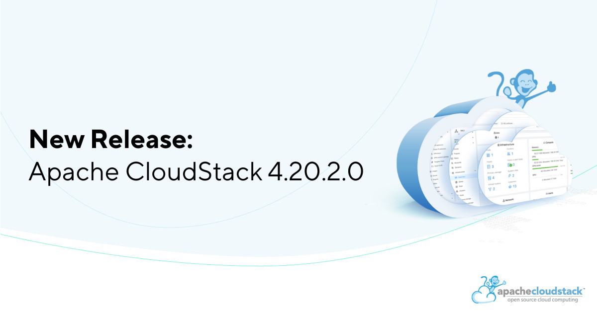

The Apache CloudStack project is pleased to announce the release of CloudStack
4.20.2.0.

<!-- truncate -->

The CloudStack 4.20.2.0 release is a maintenance release as part of
its 4.20.x LTS branch and contains around 150 fixes and
improvements since the CloudStack 4.20.1.0 release.

Some of the highlights include:

* Improvements for Vmware to KVM Migration
* Fix: Potential remote code execution on Javascript engine defined rules
* Fix: Lack of user permission validation leading to data leak for few APIs
* Optimise VNC console performance
* Some network related fixes and improvements
* ScaleIO/PowerFlex smoke tests improvements and fixes
* Some CloudStack Kubernetes Service (CKS) related fixes and improvements
* Several UI fixes and improvements
* Systemvm templates now built on Debian 12.12.0

CloudStack LTS branches are supported for 24 months and will receive
updates for the first 18 months and only security updates in the last
6 months.

Apache CloudStack is an integrated Infrastructure-as-a-Service (IaaS)
software platform that enables users to build feature-rich public and
private cloud environments. It offers an intuitive user interface and
a robust API for managing compute, networking, software, and storage
resources. The project became an Apache top-level project in March
2013.

More information about Apache CloudStack can be found at:
https://cloudstack.apache.org/

## Documentation

What's new in CloudStack 4.20.2.0:
https://docs.cloudstack.apache.org/en/4.20.2.0/releasenotes/about.html

The 4.20.2.0 release notes include a full list of issues fixed, as well
as upgrade instructions from previous versions of Apache CloudStack, and
can be found at:
https://docs.cloudstack.apache.org/en/4.20.2.0/releasenotes/

The official installation, administration, and API documentation for
each of the releases are available on our documentation page:
https://docs.cloudstack.apache.org/

## Downloads

The official source code for the 4.20.2.0 release can be downloaded from our
downloads page:

https://cloudstack.apache.org/downloads.html

In addition to the official source code release, individual contributors
have also made convenience binaries available on the Apache CloudStack
download page, and can be found at:

- https://download.cloudstack.org/el/8/
- https://download.cloudstack.org/el/9/
- https://download.cloudstack.org/suse/15
- https://download.cloudstack.org/ubuntu/dists/
- https://www.shapeblue.com/packages/
