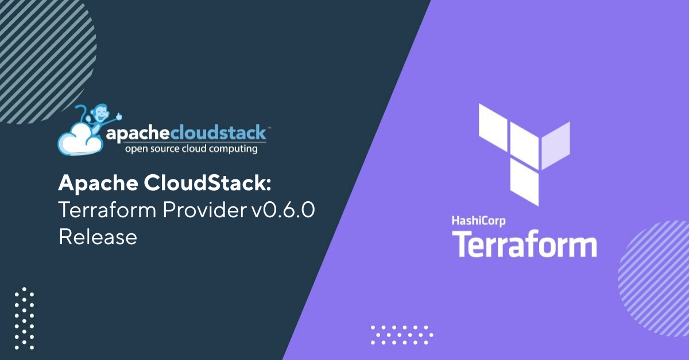

We are pleased to announce the release of Apache CloudStack Terraform provider v0.6.0.

<!-- truncate -->

Terraform is an open-source infrastructure-as-code software tool that
provides a consistent CLI workflow for managing resources across
multiple public/private clouds.

Apache CloudStack Terraform provider v0.6.0 comes packed with several
new features, enhancements, and bug fixes to make it even more robust
and reliable.

Some of the key highlights of this release include:

- Added support for Autoscale VM groups
- Added support for Snapshot policies
- Added support for Quota plugin
- Added support for Userdata
- Added support for Zonewizard resources
- Added support for Cloudstack project creation
- Added support for Flexible cks clusters
- Added support for Cloudstack roles
- Added support for Cloudstack limits
- Improved support for Creating/importing of Network ACL rules
- Improved support for Service Offering resource
- Improved support for Cloudstack instance resource
- Upgraded SDK and support for Terraform plugin framework
- Various other bug fixes

Apache CloudStack Terraform provider v0.6.0. is available for download
now from the Apache CloudStack website.

## Downloads and Documentation

The official source code for Apache CloudStack Terraform provider can
be downloaded from:

https://github.com/apache/cloudstack-terraform-provider/releases/tag/v0.6.0

The installation and usage documentation for Apache CloudStack
Terraform provider is available at:

https://github.com/apache/cloudstack-terraform-provider/wiki
https://github.com/apache/cloudstack-terraform-provider/wiki#installing-from-github-release

Users can also get the provider from the Terraform registry published
at:

https://registry.terraform.io/providers/cloudstack/cloudstack/0.6.0

The documentation for the usage of resources to create and interact
with CloudStack is available at

https://registry.terraform.io/providers/cloudstack/cloudstack/latest/docs
