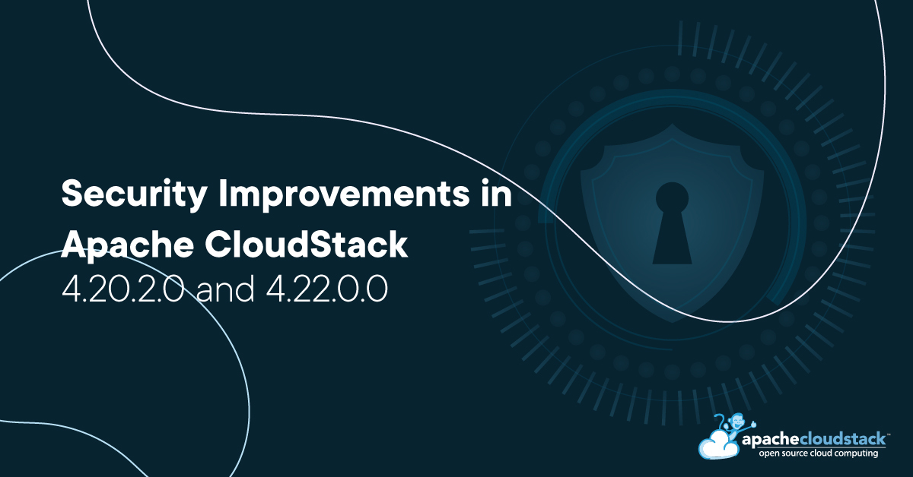

The Apache CloudStack project announces the LTS release of [4.20.2.0](https://github.com/apache/cloudstack/releases/tag/4.20.2.0) and [4.22.0.0](https://github.com/apache/cloudstack/releases/tag/4.22.0.0) that address the following security issues:

- CVE-2025-59302 (severity 'Low')
- CVE-2025-59454 (severity 'Low')

<!-- truncate -->

## [CVE-2025-59302](https://www.cve.org/CVERecord?id=CVE-2025-59302): Potential remote code execution on Javascript engine defined rules

In Apache CloudStack, improper control of generation of code ('Code Injection') vulnerability is found in the following APIs which are accessible only to admins.

- quotaTariffCreate
- quotaTariffUpdate
- createSecondaryStorageSelector
- updateSecondaryStorageSelector
- updateHost
- updateStorage

The fix introduces a new global configuration flag, js.interpretation.enabled, allowing administrators to control the interpretation of JavaScript expressions in these APIs, thereby mitigating the code injection risk.

## [CVE-2025-59454](https://www.cve.org/CVERecord?id=CVE-2025-59454): Lack of user permission validation leading to data leak for few APIs

In Apache CloudStack, a gap in access control checks affected the APIs

- createNetworkACL
- listNetworkACLs
- listResourceDetails
- listVirtualMachinesUsageHistory
- listVolumesUsageHistory

While these APIs were accessible only to authorized users, insufficient permission validation meant that users could occasionally access information beyond their intended scope.

## Credits

The CVEs are credited to the following reporters:

- CVE-2025-59302:
    - Tianyi Cheng <chengtianyi@huawei.com>

- CVE-2025-59454:
    - bugreporter@qq.com <https://github.com/ai-bugreporter/Credits>

## Affected versions:

- CVE-2025-59302:
    - Apache CloudStack 4.18.0.0 through 4.20.1.0 and 4.21.0.0

- CVE-2025-59454:
    - Apache CloudStack 4.0.0 through 4.20.1.0 and 4.21.0.0

## Resolution

Users are recommended to upgrade to version 4.20.2.0, 4.22.0.0 or later, which addresses these issues.

## Downloads and Documentation

The official source code for the 4.20.2.0 and 4.22.0.0 releases can be downloaded from the project [downloads page](/downloads).

The 4.20.2.0 and 4.22.0.0 release notes can be found at:

- https://docs.cloudstack.apache.org/en/4.20.2.0/releasenotes/about.html
- https://docs.cloudstack.apache.org/en/4.22.0.0/releasenotes/about.html

In addition to the official source code release, individual contributors have also made release packages available on the Apache CloudStack download page, and available at:

- https://download.cloudstack.org/el/8/
- https://download.cloudstack.org/el/9/
- https://download.cloudstack.org/el/10/
- https://download.cloudstack.org/suse/15/
- https://download.cloudstack.org/ubuntu/dists/
- https://download.cloudstack.org/debian/dists/
- https://www.shapeblue.com/cloudstack-packages/
