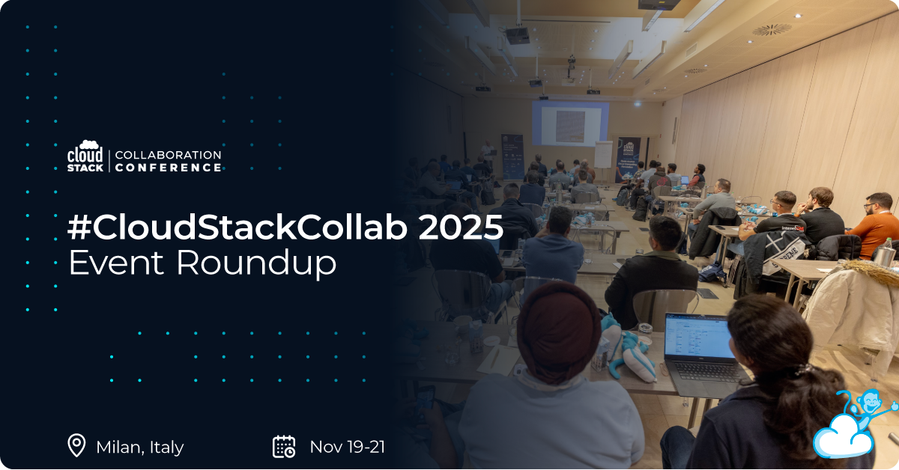

The CloudStack Collaboration Conference 2025 took place in Milan,
Italy from November 19 to 21, bringing together CloudStack users,
developers, and operators from across the global community. This
annual in person event once again provided a valuable space for
collaboration, knowledge sharing, and shaping the future of Apache
CloudStack.

<!-- truncate -->

Hosted at the Enterprise Hotel in Milan, the conference featured a
packed agenda of technical sessions, deep dive workshops, and open
discussions. Topics ranged from CloudStack architecture and
scalability to automation, storage, networking, security, and real
world operational best practices. Attendees had the opportunity to
learn directly from industry experts, exchange experiences with peers,
and explore the latest developments across the CloudStack ecosystem.

We would like to extend our sincere thanks to our 2025 sponsors for
their support in making this event possible:
[ShapeBlue](https://www.shapeblue.com/),
[US Signal](https://ussignal.com/),
[LINBIT](https://linbit.com/),
[StorPool](https://storpool.com/),
[Cyso Cloud](https://cyso.cloud/),
[DIMSI](https://www.dimsi.fr/),
[CDLAN](https://www.cdlan.it/),
[Your.Online](https://your.online/),
[Ampere](https://amperecomputing.com/),
[Stack Console](https://www.stackconsole.io/),
[Yotta](https://yotta.com/),
[proIO](https://www.proio.com/), and
[weSystems](https://wesystems.de/).

Click the button below to view the official Event Roundup blog, where
you can access the session recordings, slides, abstracts, and the
photos taken at the event.

  <a class="button button--primary" href="https://www.cloudstackcollab.org/event-roundup-cloudstack-collaboration-conference-2025/" target="_blank">Event Roundup</a>

