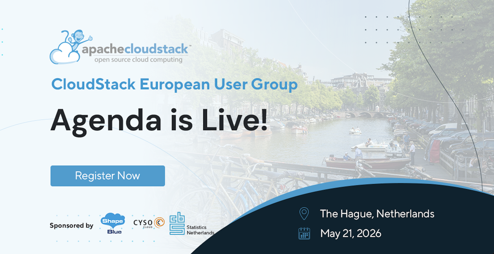

We’re excited to announce the full agenda for the upcoming *CloudStack
European User Group on 21 May* in the Hague, at CBS – Statistics
Netherlands — a full day dedicated to cloud infrastructure, digital
sovereignty, storage innovation, and real-world Apache CloudStack
deployments.

The event brings together industry experts, Apache CloudStack
contributors, and infrastructure specialists to share practical
insights, technical deep dives, and migration strategies.

<!-- truncate -->

# Event Agenda

*__09:30 – 10:00__*

__Registration and Morning Coffee __

Start the day by networking with fellow Apache CloudStack users,
partners, and community members.

*__10:00 – 10:15__*

__Event Opening and Kick Off [Ivet Petrova](https://www.linkedin.com/in/ivpetrova/) — Marketing Director, [ShapeBlue](https://www.shapeblue.com/)__

Welcome remarks and introduction to the day’s sessions.

*__10:15 – 10:30__*

__ CBS Digital Sovereignty Strategy [Erik Logtenberg](https://www.linkedin.com/in/eriklogtenberg/?originalSubdomain=nl) — CIO, [CBS](https://www.cbs.nl/en-gb)__

An overview of CBS’s approach to digital sovereignty and cloud independence.

*__10:30 – 11:00__*

__ What's New in Apache CloudStack – Release and Features Overview [Boris Stoyanov]( https://www.linkedin.com/in/bstoyanov/) — Director of Engineering, [ShapeBlue](https://www.shapeblue.com/)__

Let’s take a look at the 4.23 release and what’s new. Attendees will
walk through the latest features and enhancements, highlighting how
they improve performance, usability, and scalability. Beyond the
release notes, you’ll gain practical insights into how to apply these
updates in real-world environments - helping you get the most value
out of your CloudStack deployment.

*__11:00 – 11:10__*

__Coffee Break__

*__11:10 – 11:40__*

__A Deep-Dive Into the Integration of CloudStack and Ceph Primary Storage [Wido den Hollander]( https://www.linkedin.com/in/widodh/) — CTO, [Your.Online](https://your.online/)__

This session provides a deep dive into integrating Apache CloudStack
with Ceph as primary storage - widely considered a gold standard for
organizations building reliable, open-source IaaS platforms. We’ll
explore architecture, deployment patterns, and key design
considerations for creating scalable and resilient cloud environments.

Attendees will gain practical insights into performance optimization,
high availability, and operational best practices, along with lessons
learned from real-world experience of a decade working with both
technologies.

*__11:40 – 12:10__*

__Digital Sovereignty in Practice: Building a High-Performance Cloud Without Vendor Lock-In [Swen Brüseke](https://www.linkedin.com/in/swen-br%C3%BCseke-391912193/) — CEO, [ProIO]( https://www.proio.com/)__

Digital sovereignty is no longer just a buzzword; it has become a
critical survival strategy for enterprises. But how do you build a
cloud platform that is performant, cost-effective, and truly free from
vendor lock-in? proIO has been consistently relying on Apache
CloudStack since 2013. In this session, we will discuss why private
clouds are more relevant than ever in the current global climate and
how we push our platform to its limits as "heavy users" to deliver
premium Managed Hosting. We will provide technical insights into our
stack—from Linbit-based Hyperconverged Infrastructure (HCI) to our
strategic partnership with ShapeBlue. Join us for a look behind the
scenes from a CloudStack Committer’s perspective on the synergy
between Open Source DNA and Enterprise requirements.

*__12:10 – 12:40__*

__LINSTOR as CloudStack Primary Storage: From Theory to Production War Stories [Rene Peinthor](https://www.linkedin.com/in/rene-peinthor-588b50339/) — Software Engineer, [LINBIT](https://linbit.com/)__

This talk will start with a theoretical introduction of LINSTOR-SDS
and will then dive into common production problems and stories we
encountered and how to avoid them.

*__12:40 – 13:40__*

__Lunch Break__

## Afternoon Sessions

*__13:00 – 15:00__*

Apache CloudStack for Beginners – Workshop A dedicated hands-on
workshop designed for newcomers and those looking to strengthen their
Apache CloudStack fundamentals. Participants will learn core
architecture concepts, deployment basics, and practical operational
guidance.

*__13:40 – 14:10__*

__Kubernetes is Not the New VM: Choosing the Right Abstraction for Modern Infrastructure [Stoil Stoilov](https://www.linkedin.com/in/stoil-stoilov/) — Senior DevOps Engineer, [StorPool Storage](https://storpool.com/)__

In this talk, we challenge the “Kubernetes replaces VMs” myth and
instead present a practical, operator-focused framework for deciding
when to use Kubernetes and when to rely on virtual machines—especially
in CloudStack environments. We will explore the fundamental
differences between VMs and containers, including isolation
boundaries, lifecycle management, networking models, and operational
complexity. Through real-world scenarios, we’ll highlight where
Kubernetes excels (cloud-native workloads, horizontal scaling,
stateless services) and where VMs remain the better choice (stateful
systems, legacy applications, strong isolation requirements,
predictable performance). Finally, we’ll discuss how CloudStack users
can combine both paradigms effectively—using VMs as the foundation and
Kubernetes as a workload layer—rather than treating them as competing
technologies.

*__14:20 – 14:50__*

__Safeguarding Apache CloudStack – Data Protection & Recovery Powered by Commvault [Ruben Renders]( https://www.linkedin.com/in/rubenrenders/) — Solutions Director, MSP & Sovereign Solutions, [Commvault](https://www.commvault.com/)__

Explore how Commvault enhances Apache CloudStack with enterprise-grade
data protection and recovery. Attendees will gain insight into
Commvault’s broader portfolio while learning how to build a strong
foundation for cyber resilience; supported by a demo and practical
implementation blueprints.

*__14:50 – 15:15__*

__Coffee Break__

*__15:15 – 15:45__*

__CloudStack Multisite Networking [Noa Omer](https://www.linkedin.com/in/noa-omer/?originalSubdomain=nl) — Platform Engineer, [Cyso Group](https://cyso.com/en/)__

In this session, Noa, Platform Engineer at Cyso Cloud, presents how
Cyso deploys Apache CloudStack to establish multisite networking
across two geographically distributed regions. The presentation covers
cross-region zone interconnectivity, network fabric design, and
routing configuration, alongside an honest account of the operational
complexities encountered and the outcomes achieved.

*__15:55 – 16:30__*

__From VMware to CloudStack/KVM: A Structured Migration Strategy with Minimal Downtime [Ingo Jochim](https://www.linkedin.com/in/ingo-jochim/?locale=en_US), Head of Cloud Architecture & [Prashanth Reddy](https://www.linkedin.com/in/prashanth-mandadi-reddy/), Cloud Architect — ShapeBlue__

As organizations look to reduce vendor lock-in and regain control over
their infrastructure, migrating from VMware to open-source platforms
like Apache CloudStack with KVM is becoming an increasingly relevant
path. However, such migrations require careful planning to ensure
reliability, continuity, and minimal disruption to workloads.

This talk presents a structured, practical approach to migrating
virtualized environments from VMware to CloudStack/KVM. It covers the
full migration lifecycle, starting with environment discovery and
detailed documentation, followed by planning and technical
preparation. Attendees will learn how to validate the migration
process through controlled

test migrations before executing large-scale mass migrations.

A key focus of the session is achieving migrations with minimal
downtime. The presentation will explore techniques such as warm
migration, performing an initial bulk data transfer in advance, and
executing a short cutover window using delta synchronization to
transfer only the final changes.

## Join Us on 21 May

Whether you're new to Apache CloudStack or an experienced operator, this event offers valuable insights, technical learning, and networking opportunities.

Register now and meet the community on *21 May* for a day of learning, collaboration, and Apache CloudStack innovation.

The event is supported by ShapeBlue, Cyso Group and CBS – Statistics Netherlands.

<a class="button button--primary" href="https://www.eventbrite.co.uk/e/cloudstack-european-user-group-2026-tickets-1980615585533?aff=oddtdtcreator" target="_blank">Register Now</a>

