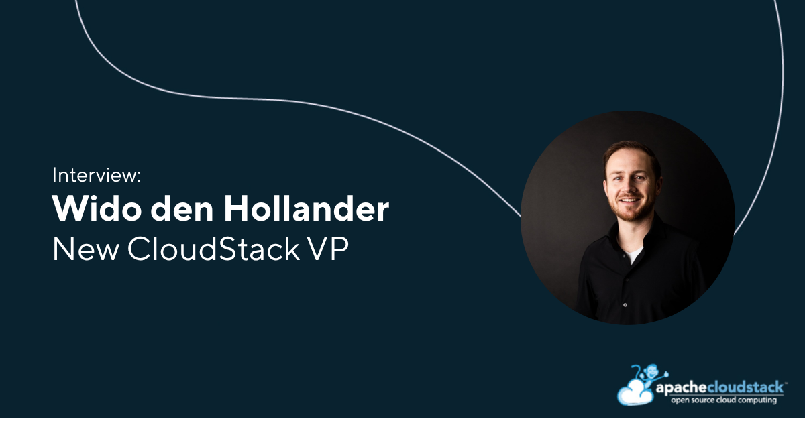
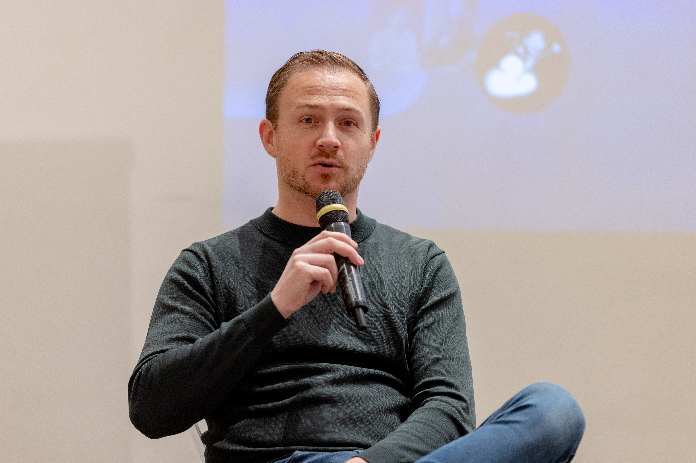
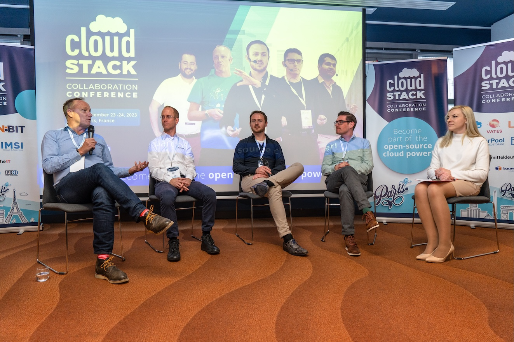
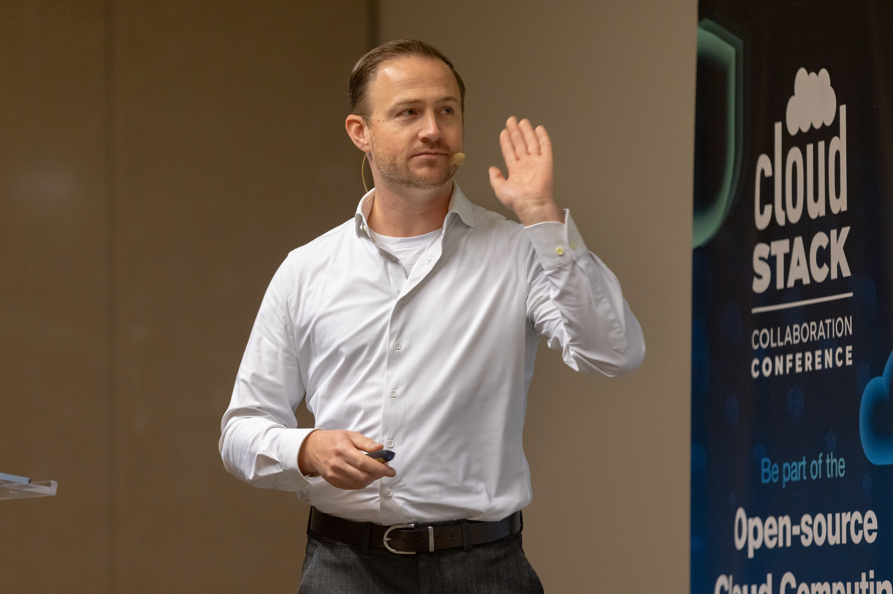

# Meet the New VP of CloudStack: Wido den Hollander

## Wido den Hollander Voted as VP of Apache CloudStack

The Apache Software Foundation community has voted [Wido den
Hollander](https://www.linkedin.com/in/widodh/) as the new Vice
President of Apache CloudStack. A long-time PMC member and
contributor, Wido has been working on CloudStack for over 15 years,
bringing deep technical experience and real-world operational insight
from the cloud industry.  This blog shares key snippets from [Wido’s
first interview](https://www.youtube.com/watch?v=wP7ogfFPDLk) since
being voted CloudStack VP for 2026.

<!-- truncate -->

## Getting started with CloudStack

Wido’s journey into CloudStack is rooted in practical experience. He
has been active in the hosting industry since 2004, building and
operating infrastructure for over two decades.

“I've been in the hosting and IT industry since 2004, so it's about 23
years now. My background is hosting and I've been a user, a
contributor, and PMC member, and actually a VP member before of the
Apache CloudStack project.”

His introduction to CloudStack came from a need to move beyond custom-built infrastructure:

“I always ran a web hosting company... during that journey we had our
KVM environment built with bash scripts, and we looked for something
else. This is when I stumbled upon what was cloud.com from citrix,
which was about to be donated to the Apache Software Foundation. So,
through that journey we started adopting Apache CloudStack in my
hosting company and we have been using it ever since.”

Wido’s first contribution dates back to 2011, focusing on improving packaging:

“My first contribution to the project was actually an improvement in
the Debian and Ubuntu packaging... I sent my first patches to improve
the packaging for Ubuntu.”

## Perspective on the CloudStack project

Over the years, he has remained deeply involved in both development
and governance. His appointment as VP reflects this long-standing
commitment.

“I would say the VP is somebody who keeps everybody together, talks
with the ASF, is the face of the project for a year.”

A key theme in Wido’s perspective is reliability:

“CloudStack is a reliable foundation to build your company upon. There
have been many great features, bugs have been resolved, enhancements
in CloudStack. But the main thing is it is reliable”.

He also highlights governance as a critical differentiator:

“The governance of the ASF - that's a truly reliable foundation to run
your company upon.”

## Evolution for the technology

Looking ahead, Wido sees CloudStack continuing to evolve:

“I think it's going to be evolutions within CloudStack. We are quite
feature-ready If you look at IaaS, there are a few upcoming features I
am looking forward to. For example, the DNS provider where you can
manage DNS from CloudStack. So, you have a single environment where
you can manage VMs, object storage, and then also DNS connected to
different providers. And I would like to personally investigate a
possibility where we can get some telemetry back to the project on an
opt-in basis.”

Importantly, Wido wants to challenge the perception that CloudStack is
only for large-scale deployments:

“CloudStack still seems like this giant monster for some
people. That's a myth I would like to bust, because even with just a
few servers, you could have a great Apache CloudStack deployment.”

He reinforces this with a real-world example of a compact deployment
that still delivers enterprise-grade features.

## Community

Wido is also passionate about community:

“The culture should be that everybody is welcome and we should respect
everybody and be grateful for anything somebody contributes.”

He encourages new contributors to get involved:

“We should be open to anybody submitting a pull request in
GitHub. What I heard from feedback from some developers is that it
sometimes feels very scary to send your first pull request to a GitHub
project which has been around for 15 years and then you come along
from somewhere on this planet and you send your first pull
request. You're like, oh, what's going to happen? Are they going to be
angry with me if I make a mistake? No, everybody should be welcome to
open their first PR.”

## Growth

Despite often operating behind the scenes, CloudStack continues to grow:

“It is still growing, yes. And I think that is a misconception which
sometimes exists because CloudStack just is there as an IaaS, powering
these enormous environments, but also many smaller environments. But
it's taken for granted by so many people. So, it's no longer in the
really big hype cycle. As I said, there's evolutions, no longer
revolutions.”

Wido concludes with a message to the community:

“I want to thank everybody for contributing, for being part of the
project. I would like to encourage everybody to contribute more and
new users to step into the community, be active, stand up, and you are
more than welcome to send in contributions which can be documentation,
pull requests for code. But be at events, be vocal, or just help
somebody on the mailing lists.”

<a class="button button--primary" href="https://www.youtube.com/watch?v=wP7ogfFPDLk" target="_blank">Watch the full interview</a>

