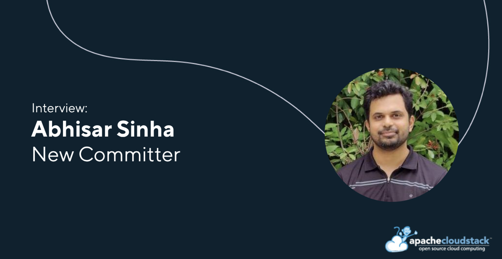

[Abhisar Sinha](https://www.linkedin.com/in/abhisar-sinha-04016618/)
has been appointed as a Committer to the CloudStack project. In this
written interview, we catch up with Abhisar to learn more about his
journey into the community, the contributions he has made across key
areas of the project, and the work he is currently focused on. We also
explore his perspective on recent developments in Apache CloudStack,
as well as what he would like to see next as the project continues to
evolve.

<!-- truncate -->

##### Introduce yourself in a few words and what your current job role is

Hi, I am Abhisar Sinha, working as a Senior Software Engineer at
ShapeBlue since early 2024. I have 14 years of industry experience. My
day-to-day work involves developing new features and interacting with
the community, including fixing bugs, reviewing PRs, contributing to
discussions, and managing releases.

##### What are some of your key contributions to the Apache CloudStack project?

I have worked on the Shared FileSystem feature, which was a marquee
feature in 4.20. Since then, I have focused on Backup and Recovery
infrastructure improvements, including features like Create Instance
from Backup. In 4.22, I developed the inbuilt extensions for Proxmox
and Hyper-V as part of the Extensions Framework. Currently, I am
working on Veeam integration for KVM in CloudStack, as well as the VPN
Provider Framework.

##### What would your advice be to people interested in the CloudStack project, but not sure how to get involved?

I would recommend getting involved with the community through mailing
lists or GitHub. Explore areas that interest you, go through the
available guides and documentation, and don’t hesitate to reach
out. Let the community know you’re interested, and people will help
guide you.

##### What do you think are some of the standout features introduced in the last two years?

CloudStack has seen a significant number of new features and
improvements over the last couple of years. Some standout additions
include ARM64 support, GPU as a first-class feature, the Extensions
Framework, and continued enhancements to the Backup and Recovery
framework.

##### What are some features that have not been developed yet and are not in the current roadmap that you would like to see

I would like to see a feature that makes troubleshooting easier,
possibly integrated into the UI and APIs, using AI to analyze logs and
identify the most probable causes of failures.

Another interesting direction for CloudStack could be expansion into
managed services. Shared FileSystems is one such example, but it could
benefit from improvements like auto-scaling and broader protocol
support. Database-as-a-Service could also be a valuable addition.
