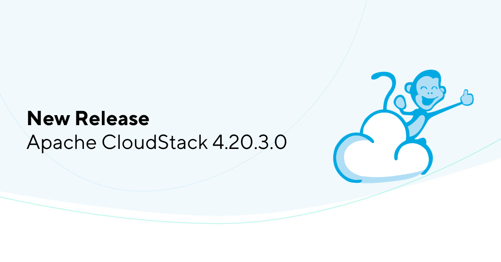

The Apache CloudStack project is pleased to announce the release of CloudStack
4.20.3.0.

<!-- truncate -->

The CloudStack 4.20.3.0 release is a maintenance release as part of
its 4.20.x LTS branch and contains around 150 fixes and
improvements since the CloudStack 4.20.1.0 release.

Some of the highlights include:

Support for Mysql 8.4
* Prioritize copying templates from other secondary storages instead of downloading them
* New Prometheus metric to track host certificate expiry
* KVM DRS optimizations
* Support for custom SSH port for KVM hosts
* Support for configurable IP ranges per remote access VPN
* Support live migration to Linstor from other primary storages
* Support for deploy-as-is template as VNF template
* Some improvements related to secondary storage selectors
* CKS cluster scaling and resource limits fixes
* Several Usage server related fixes
* Some fixes related to Snapshot physical size reporting
* Several UI fixes and improvements

CloudStack LTS branches are supported for 24 months and will receive
updates for the first 18 months and only security updates in the last
6 months.

Apache CloudStack is an integrated Infrastructure-as-a-Service (IaaS)
software platform that enables users to build feature-rich public and
private cloud environments. It offers an intuitive user interface and
a robust API for managing compute, networking, software, and storage
resources. The project became an Apache top-level project in March
2013.

More information about Apache CloudStack can be found at:
https://cloudstack.apache.org/

## Documentation

What's new in CloudStack 4.20.3.0:
https://docs.cloudstack.apache.org/en/4.20.3.0/releasenotes/about.html

The 4.20.3.0 release notes include a full list of issues fixed, as well
as upgrade instructions from previous versions of Apache CloudStack, and
can be found at:
https://docs.cloudstack.apache.org/en/4.20.3.0/releasenotes/

The official installation, administration, and API documentation for
each of the releases are available on our documentation page:
https://docs.cloudstack.apache.org/

## Downloads

The official source code for the 4.20.3.0 release can be downloaded from our
downloads page:

https://cloudstack.apache.org/downloads.html

In addition to the official source code release, individual contributors
have also made convenience binaries available on the Apache CloudStack
download page, and can be found at:

- https://download.cloudstack.org/el/8/
- https://download.cloudstack.org/el/9/
- https://download.cloudstack.org/el/10/
- https://download.cloudstack.org/suse/15
- https://download.cloudstack.org/ubuntu/dists/
- https://www.shapeblue.com/packages/
