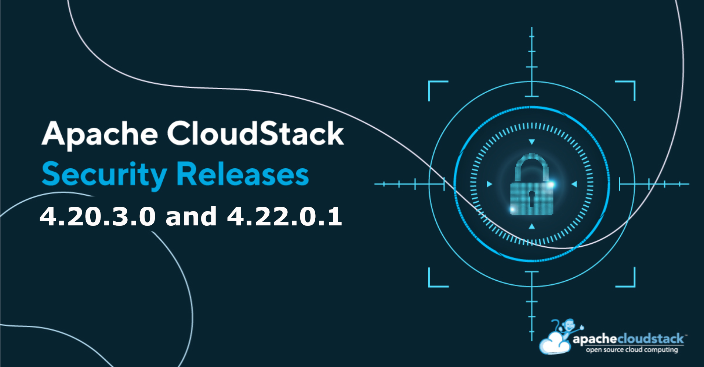

The Apache CloudStack project announces the release of LTS releases [4.20.3.0](https://github.com/apache/cloudstack/releases/tag/4.20.3.0) and [4.22.0.1](https://github.com/apache/cloudstack/releases/tag/4.22.0.1) that address the following security issues:

- CVE-2025-66170 (severity 'Low')
- CVE-2025-66171 (severity 'Important')
- CVE-2025-66172 (severity 'Important')
- CVE-2025-66467 (severity 'Important')
- CVE-2025-69233 (severity 'Moderate')
- CVE-2026-25077 (severity 'Important')
- CVE-2026-25199 (severity 'Moderate')

<!-- truncate -->

## [CVE-2025-66170](https://www.cve.org/CVERecord?id=CVE-2025-66170): Any user can list backups that they should not have access to.

### Credits

The CVEs are credited to the following reporters:

- CVE-2025-66170:
  - Fabricio Duarte <fabricio.duarte.jr@gmail.com> (reporter)
  - Gabriel Ortiga Fernandes <gabrielpordeus@gmail.com> (reporter)

### Affected versions:

- CVE-2025-66170:
  - Apache CloudStack 4.21.0.0 through 4.22.0.0

### Resolution

Users are recommended to upgrade to version 4.22.0.1 or later, which addresses these issues.

## [CVE-2025-66171](https://www.cve.org/CVERecord?id=CVE-2025-66171): Any user can create a new VM from backups they should not have access to

### Credits

The CVEs are credited to the following reporters:

- CVE-2025-66171:
  - Fabricio Duarte <fabricio.duarte.jr@gmail.com> (reporter)
  - Gabriel Ortiga Fernandes <gabrielpordeus@gmail.com> (reporter)

### Affected versions:

- CVE-2025-66171:
  - Apache CloudStack 4.21.0.0 through 4.22.0.0

### Resolution

Users are recommended to upgrade to version 4.22.0.1 or later, which addresses these issues.

## [CVE-2025-66172](https://www.cve.org/CVERecord?id=CVE-2025-66172): Any user can attach a volume in their VMs from backups they should not have access to

### Credits

The CVEs are credited to the following reporters:

- CVE-2025-66172:
  - Fabricio Duarte <fabricio.duarte.jr@gmail.com> (reporter)
  - Gabriel Ortiga Fernandes <gabrielpordeus@gmail.com> (reporter)

### Affected versions:

- CVE-2025-66170:
  - Apache CloudStack 4.21.0.0 through 4.22.0.0

### Resolution

Users are recommended to upgrade to version 4.22.0.1 or later, which addresses these issues.

## [CVE-2025-66467](https://www.cve.org/CVERecord?id=CVE-2025-66467): MinIO policy remains intact on bucket deletion

### Credits

The CVEs are credited to the following reporters:

- CVE-2025-66467:
  - Roman Kozello (reporter)

### Affected versions:

- CVE-2025-66467:
  - Apache CloudStack 4.19.0.0 through 4.20.2.0
  - Apache CloudStack 4.21.0.0 through 4.22.0.0

### Resolution

Users are recommended to upgrade to version 4.20.3.0 or 4.22.0.1 or later, which addresses these issues.

## [CVE-2025-69233](https://www.cve.org/CVERecord?id=CVE-2025-69233): Domain/account resources limits not honored

### Credits

The CVEs are credited to the following reporters:

- CVE-2025-69233:
  - Fernando Oliveira (reporter)
  - Gustavo Viana (reporter)

### Affected versions:

- CVE-2025-66467:
  - Apache CloudStack 4.0.0 through 4.20.2.0
  - Apache CloudStack 4.21.0.0 through 4.22.0.0

### Resolution

Users are recommended to upgrade to version 4.20.3.0 or 4.22.0.1 or later, which addresses these issues.

## [CVE-2026-25199](https://www.cve.org/CVERecord?id=CVE-2026-25199): Proxmox Extension Allows Unauthorized Cross-Tenant Instance Access

### Credits

The CVEs are credited to the following reporters:

- CVE-2026-25199:
  - Sander Grendelman <sander.grendelman@axians.com> (reporter)

### Affected versions:

- CVE-2026-25199:
  - Apache CloudStack 4.21.0.0 through 4.22.0.0

### Resolution

Users are recommended to upgrade to version 4.22.0.1 or later, which addresses these issues.

## Downloads and Documentation

The official source code for the 4.22.0.1 release can be downloaded from the project downloads page:

https://cloudstack.apache.org/downloads

The 4.22.0.1 release notes can be found at:
- https://docs.cloudstack.apache.org/en/4.22.0.1/releasenotes/about.html

In addition to the official source code release, individual contributors have also made release packages available on the Apache CloudStack download page, and available at:

- https://download.cloudstack.org/el/7/
- https://download.cloudstack.org/el/8/
- https://download.cloudstack.org/el/9/
- https://download.cloudstack.org/suse/15/
- https://download.cloudstack.org/ubuntu/dists/
- https://www.shapeblue.com/cloudstack-packages/
