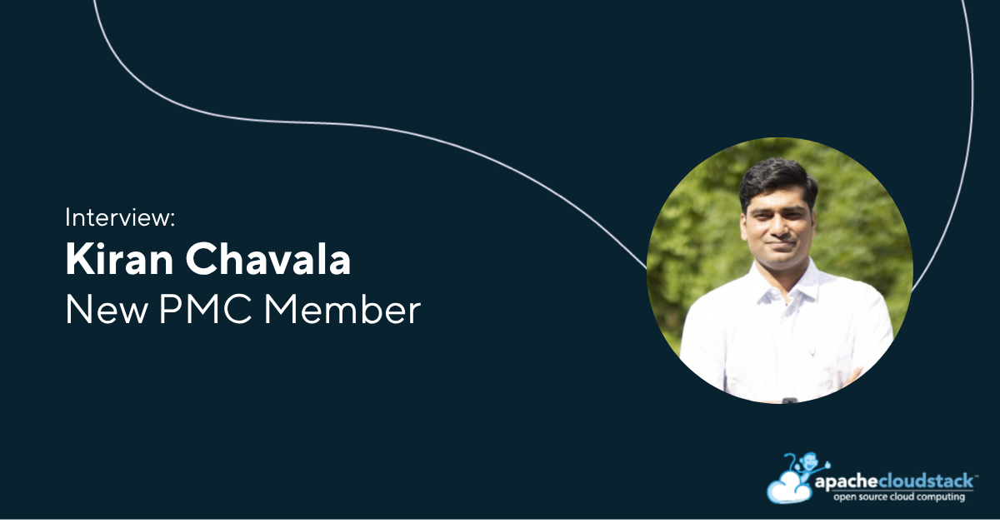

[Kiran Chavala](https://www.linkedin.com/in/kiranchavala) is the newest PMC
member of the Apache CloudStack Project. As a QA Engineer at ShapeBlue, Kiran
brings over a decade of experience in cloud and IaaS technologies, along with a
strong track record of contributions across testing, feature validation,
observability, and community support.

In this interview, Kiran shares his journey with Apache CloudStack, his
perspective on the value of open-source collaboration, and the projects he’s
been working on — from Terraform plugin releases to Kubernetes integration and
monitoring tools. He also discusses how global community collaboration drives
innovation and outlines his vision for the future of CloudStack, including
sovereign cloud initiatives, AI-ready infrastructure, and continued growth
driven by flexibility and vendor independence.

<!-- truncate -->

##### Introduce yourself in a few words and what your job role/company is?

I’m Kiran Chavala, a QA Engineer at ShapeBlue with over a decade of experience
in cloud and IaaS technologies. I work extensively with Apache CloudStack, where
my role involves testing new features, identifying bugs and security-related
issues, and ensuring overall product quality before releases. I also contribute
to improving user experience, documentation, and tooling within the CloudStack
ecosystem, while actively supporting users and community members.

##### What do you think are the benefits of utilising open-source projects, like CloudStack?

Open-source projects like Apache CloudStack provide unmatched flexibility,
transparency, and innovation. Organisations can avoid vendor lock-in and tailor
solutions to their specific needs while benefiting from a globally distributed
community of contributors continuously improving the platform.

From my experience, open-source fosters faster innovation cycles—features evolve
through real-world feedback, and issues are quickly identified and resolved. It
also creates opportunities for collaboration across organisations, enabling
knowledge sharing and building highly scalable, production-grade cloud
environments without licensing constraints.

##### How do you collaborate with the community distributed around the world?

Collaboration in open source is inherently global, and I engage with the
CloudStack community through multiple channels. This includes participating in
mailing list requests, contributing to GitHub pull requests, and helping users
troubleshoot issues.

I also share knowledge through blogs, talks, and documentation, which helps
onboard new users and contributors. Being part of a distributed community means
working asynchronously, respecting different time zones, and communicating
clearly through well-documented discussions and code contributions. This
collaborative model ensures that ideas and improvements come from diverse
perspectives.

##### What are some key projects and developments you have worked on and are currently working on?

I’ve contributed to Apache CloudStack across several areas, including UI
improvements, API validation, and feature validation. My work involves raising
issues and discussions in the CloudStack Community.

I’m also actively working with the CloudStack Plugin and tooling ecosystem,
including:
* Served as Release Manager for the Terraform plugin of CloudStack
* Observability using Prometheus and Grafana
* Kubernetes integration with CloudStack
* Monitoring and benchmarking tools for cloud environments

Additionally, I regularly experiment with new open-source technologies and share
my learnings through blogs and community discussions.

##### How do you think the CloudStack project will continue to grow over the next five years?

Apache CloudStack is well-positioned for steady, meaningful growth over the next
five years, especially as organisations increasingly prioritise control,
compliance, and flexibility in their infrastructure.

One of the biggest drivers will be the rise of sovereign cloud initiatives, in
which governments and enterprises seek full ownership of their data,
infrastructure, and security posture. CloudStack’s open-source nature, combined
with its mature multi-tenancy and networking capabilities, makes it an ideal
platform for building sovereign and regionally compliant cloud environments
without relying on hyperscalers.

Vendor lock-in becomes critical. CloudStack’s open-source model enables
organisations to retain complete control over their stack, choose their own
hardware and integrations, and build cloud environments that align with regional
and regulatory requirements—without being tied to a single vendor ecosystem.

Another important area is AI and data-intensive workloads. The infrastructure
requirements for AI/ML—such as GPU orchestration, scalable storage, and
high-performance networking—align well with CloudStack’s strengths. With
continued enhancements around GPU support, automation, and integration,
CloudStack can serve as a strong foundation for private AI clouds and research
environments.
