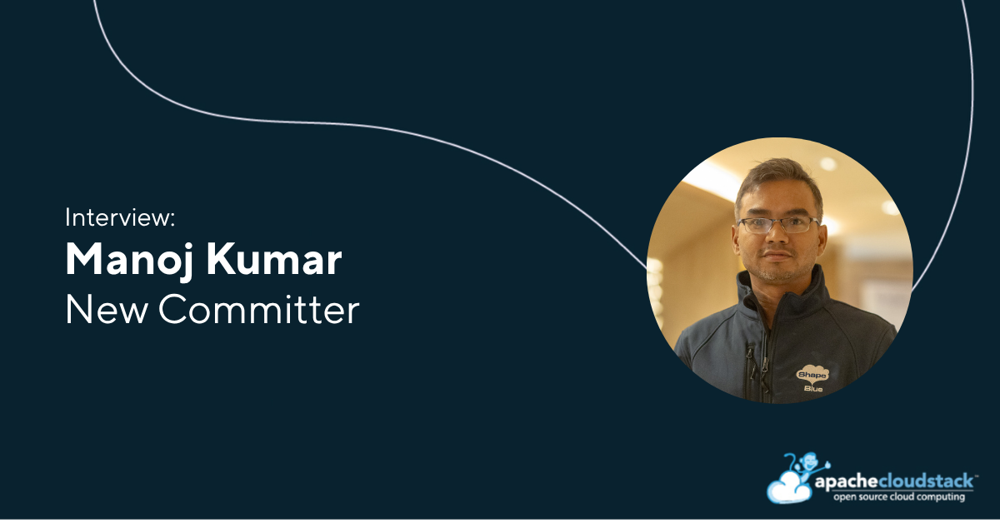

[Manoj Kumar](https://www.linkedin.com/in/manoj-kumar-66b627a/) is now a
Committer to the Apache CloudStack project. In this interview, he shares his
journey as a software engineer at ShapeBlue and his experience contributing to
Apache CloudStack. He discusses some of his key contributions to the project,
including platform improvements, automation features, and the CloudStack
One-line Installer, while also highlighting the importance of community
collaboration and consistent contribution.

Manoj also reflects on major developments in CloudStack over the past two years,
such as GPU support and VMware-to-KVM migration, and shares his thoughts on
future opportunities around observability, infrastructure integrations, and
AI-focused workloads.

<!-- truncate -->

##### Introduce yourself in a few words and what your current job role is?

I’m Manoj Kumar, a Senior Software Engineer at ShapeBlue. I’ve been in software
engineering for around 14 years, working across different domains—from digital
marketing systems to large data platforms at Oracle and Master Data Management
solutions.

At ShapeBlue, I work on Apache CloudStack. My day-to-day work involves building
new features, fixing issues, writing documentation, and reviewing PRs. It’s a
mix of development and community collaboration.

##### What are some of your key contributions to the Apache CloudStack project?

I’ve worked on a range of features across backend, UI, automation, and platform
improvements:

* CloudStack One-line Installer: GitHub Repository
* Instance Lease feature
* Making KVM domains persistent when unmanaged from CloudStack
* Enforcing password changes after admin reset (root/domain users)
* Auto-populating templates during zone deployment

Recently, I’ve also started actively participating in PR reviews and
release-related activities. That’s been a great learning experience and has
helped me understand the project more deeply.

##### What would your advice be to people interested in the CloudStack project, but not sure how to get involved?

My advice is simple—start small and stay consistent.

There are many ways to contribute beyond just code:

* Join the community and follow discussions to understand how things work
* Try installing and using CloudStack (the one-line installer helps a lot)
* Documentation is a great starting point and very impactful
* Pick an area you’re comfortable with—UI, backend, database, scripts, etc.
* Report issues and try fixing them when possible
* Ask questions and share your experiments with the community
* Be patient; contributions grow over time with consistency

##### What do you think are some of the standout features introduced in the last two years?

A few things stand out for me.
GPU support is a major addition, especially with growing AI/ML workloads. The
extension framework is another important improvement that makes CloudStack
easier to extend in a clean way.

There has also been solid progress on VMware-to-KVM migration, helping users
move toward open infrastructure. Improvements in backup and recovery have also
strengthened day-to-day operational reliability.

##### What are some features that have not been developed yet and are not in the current roadmap that you would like to see?

From my perspective, there are a few interesting areas for future improvement.

Better observability and operability would go a long way—especially for
large-scale environments, where debugging and visibility can be challenging.

Deeper storage and networking integrations would also be valuable as
infrastructures become more heterogeneous.

And finally, I think there is a big opportunity in the AI infrastructure
space—making CloudStack more aligned with GPU-heavy, high-performance, modern
data center workloads.
