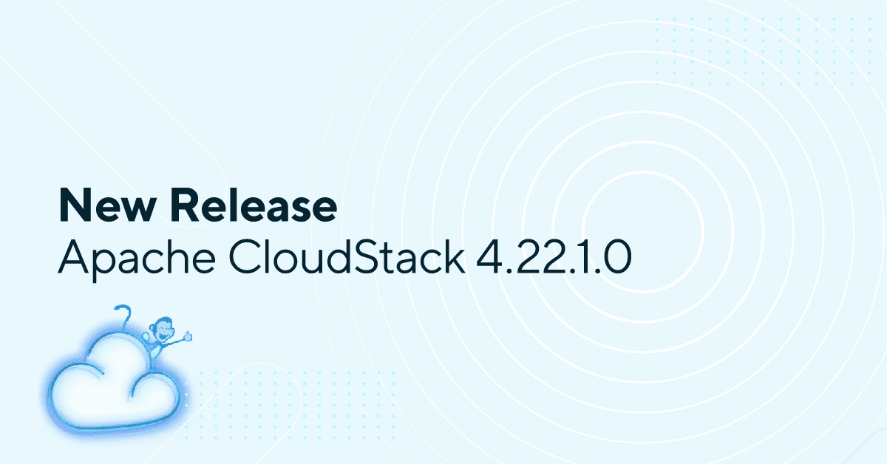

# Apache CloudStack LTS Maintenance Release 4.22.1.0

The Apache CloudStack project is pleased to announce the release of CloudStack 4.22.1.0.

The CloudStack 4.22.1.0 release is a maintenance release as part of its 4.22.x LTS branch and contains around 290 fixes and improvements since the CloudStack 4.22.0.0 release. Some of the highlights include:

<!-- truncate -->

· VMware-to-KVM migration fixes and improvements, including VDDK support and guest OS handling

· GPU domain parsing fixes and PCI display controller support

· Support configurable settings in the Proxmox Extension

· Host VM power reporting improvements in Extensions

· Support UEFI on KVM hosts by default with preconfigured default settings.

· B&R enhancements, including NAS backup support with Linstor, timeout configuration support and other backup fixes

· KVM Host HA improvements and heartbeat enhancements for SharedMountPoint storage

· Support for creating volumes directly on a specified storage pool

· Support KVM import and unmanage operations for SharedMountPoint pools

· Support to list and query async jobs by resource

· Better VM lifecycle handling, including reserved resource cleanup and improved expunge error reporting

· Networking fixes and improvements for NSX, Routed VPCs, Load Balancer rules, Static Routes, and VPN DH groups

· Incremental volume snapshot fixes and snapshot rollback reliability improvements for KVM

· Storage plugins - Ceph, Linstor, PowerFlex related fixes and improvements

· Some CKS related fixes and improvements

· Several UI fixes and improvements

CloudStack LTS branches are supported for 24 months and will receive updates for the first 18 months and only security updates in the last 6 months.

Apache CloudStack is an open-source software system designed to deploy and manage large networks of virtual machines, as a highly available, highly scalable Infrastructure as a Service (IaaS) cloud computing platform. CloudStack includes an intuitive user interface and rich API for managing the compute nodes, networking software, and storage resources, that allows users to build feature-rich public and private cloud environments. The project became an Apache top-level project in March, 2013 and is currently deployed in thousands of organizations globally.

More information about Apache CloudStack can be found at: https://cloudstack.apache.org/

# Documentation

What's new in CloudStack 4.22.1.0: https://docs.cloudstack.apache.org/en/4.22.1.0/releasenotes/about.html

The 4.22.1.0 release notes include a full list of issues fixed, as well as upgrade instructions from previous versions of Apache CloudStack, and can be found at: https://docs.cloudstack.apache.org/en/4.22.1.0/releasenotes/

The official installation, administration, and API documentation for each of the releases are available on our documentation page: https://docs.cloudstack.apache.org/

# Downloads

The official source code for the 4.22.1.0 release can be downloaded from our downloads page:

https://cloudstack.apache.org/downloads.html

In addition to the official source code release, individual contributors have also made convenience binaries available on the Apache CloudStack download page, and can be found at:

https://download.cloudstack.org/el/8/

https://download.cloudstack.org/el/9/

https://download.cloudstack.org/el/10/

https://download.cloudstack.org/suse/15/

https://download.cloudstack.org/ubuntu/dists/

https://download.cloudstack.org/debian/dists/

https://www.shapeblue.com/cloudstack-packages/

##### A Word from the Community

<em>
“Apache CloudStack 4.22.1.0 is the first maintenance update for the 4.22.x LTS branch, delivering close to 290 fixes and enhancements aimed at improving platform stability, performance, and operational efficiency. The release introduces several improvements across VMware-to-KVM migration workflows, KVM Host HA, B&R operations, snapshots, networking, storage integrations, and VM lifecycle management. Enhancements such as improved GPU and PCI controller handling, Proxmox extension configurability, default UEFI support on KVM hosts, and expanded SharedMountPoint capabilities further strengthen the platform for modern cloud deployments.

This release reflects the continuous efforts of the Apache CloudStack community to improve the day-to-day operational experience for cloud operators and service providers running production environments at scale, while remaining committed to the project’s long-term sustainability and continued growth.”
</em>

\- Suresh Kumar Anaparti, CloudStack Committer & PMC Member, 4.22.1 Release Manager

