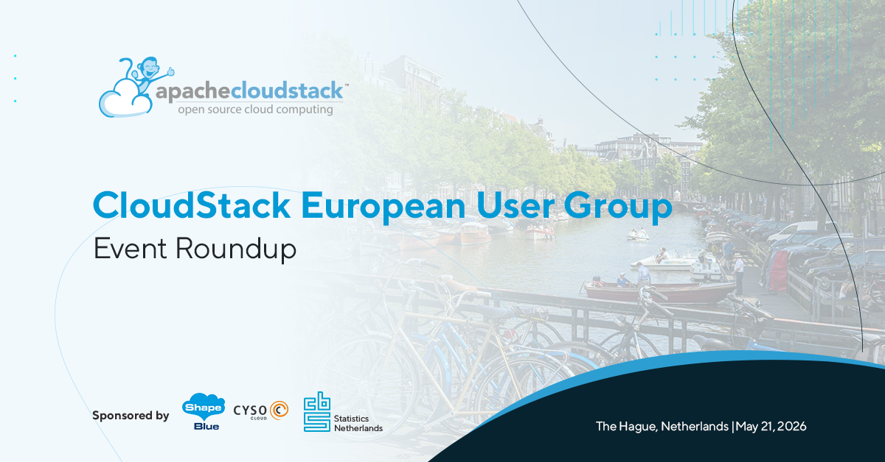

The recent Apache CloudStack European User Group, held in The Hague on
21 May, was officially recognized as the largest CloudStack User Group
event to date. The event brought together cloud builders, researchers,
and technology enthusiasts for a full day of technical presentations,
knowledge sharing, and engaging community discussions - highlighting
the continued growth and momentum of the CloudStack community.

<!-- truncate -->

  <a class="button button--primary" href="https://www.youtube.com/watch?v=GTN-l-B-iPY&list=PLnIKk7GjgFlbrStHohANRr8-IuX4EE1pq" target="_blank" rel="noopener noreferrer">Watch Session Recordings</a>

 

If you were unable to attend in person but would still like to follow
the latest developments in the CloudStack community and explore the
hot topics discussed during the event, below you can find the session
slides, abstracts, and speakers’ social links for further discussion
and networking.

Access each session's slides by clicking onto the presentation
graphic.

##### Welcome to the CloudStack European User Group – [Ivet Petrova](https://www.linkedin.com/in/ivpetrova/), [ShapeBlue](https://www.linkedin.com/company/shapeblue/)

Ivet Petrova opened the event with an introduction to the Apache
CloudStack community, highlighting the platform’s growth, goals, and
future direction.  The session focused on fostering collaboration
around cloud technologies, including hypervisors, storage solutions,
and ecosystem integrations, while showcasing the strength of the
CloudStack community.

[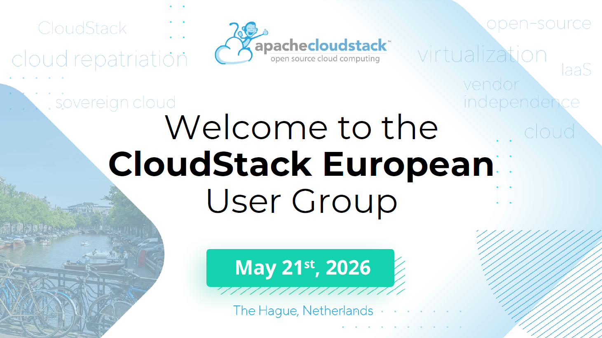](https://www.slideshare.net/slideshow/welcome-to-thecloudstack-europeanuser-group-ivet-petrova/287784013)

##### CBS Digital Sovereignty Strategy – [Erik Logtenberg](https://www.linkedin.com/in/eriklogtenberg/), [CBS](https://www.linkedin.com/company/centraal-bureau-voor-de-statistiek/)

Representing Statistics Netherlands, Erik Logtenberg shared how digital sovereignty is becoming a strategic priority for public sector organizations.

Attendees gained insight into how the Dutch national statistics office approaches cloud independence, resilience, and long-term infrastructure control, while reducing dependency on external vendors without compromising flexibility or performance.

[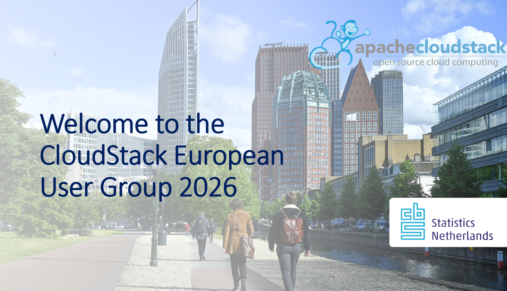](https://www.slideshare.net/slideshow/cbs-digital-sovereignty-strategy-erik-logtenberg-cbs/287804143)

##### What’s New in Apache CloudStack – Release and Features Overview – [Boris Stoyanov](https://www.linkedin.com/in/bstoyanov/), ShapeBlue

Boris Stoyanov explored the latest Apache CloudStack 4.23 release and its newest features and enhancements.

The session highlighted improvements in performance, usability, and scalability, while also providing practical guidance on applying these updates in real-world environments to maximize the value of CloudStack deployments.

[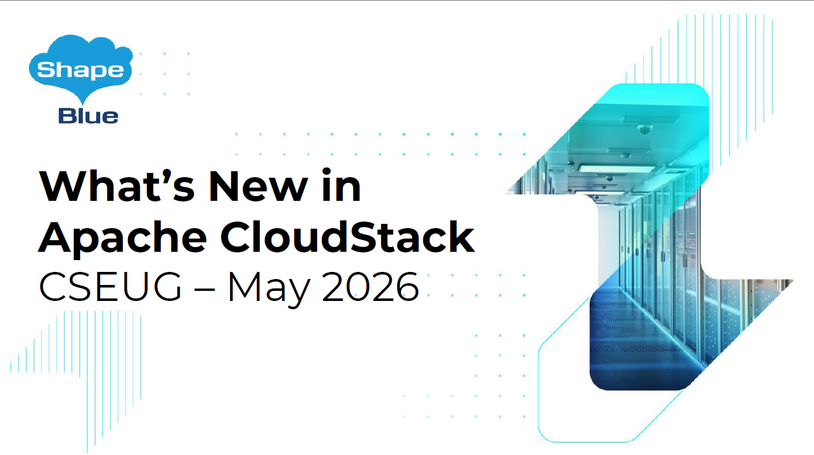](https://www.slideshare.net/slideshow/what-s-new-in-apache-cloudstack-boris-stoyanov/287784113)

##### A Deep Dive into the Integration of CloudStack and Ceph Primary Storage – [Wido den Hollander](https://www.linkedin.com/in/widodh/), [Your.Online](https://your.online/)

Wido den Hollander delivered a deep dive into integrating Apache CloudStack with Ceph as primary storage — widely regarded as a gold standard for organizations building reliable, open-source IaaS platforms.

The session covered architecture, deployment patterns, and key design considerations for building scalable and resilient cloud environments. Attendees also gained practical insights into performance optimization, high availability, and operational best practices, supported by lessons learned from more than a decade of hands-on experience with both technologies.

[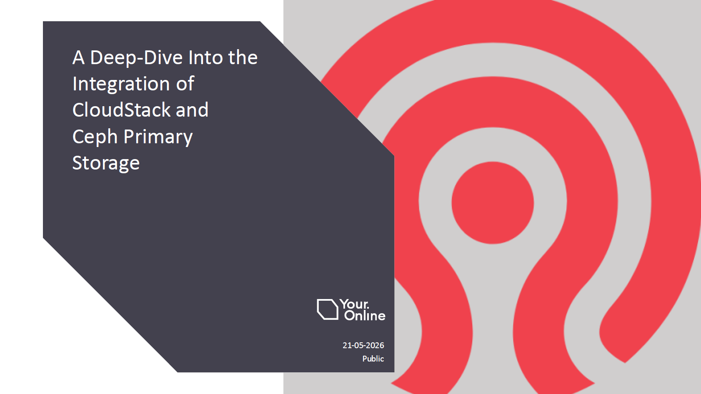](https://www.slideshare.net/slideshow/a-deep-dive-into-the-integration-of-cloudstack-and-ceph-primary-storage-cloudstack-wido-den-hollander/287784297)

##### Digital Sovereignty in Practice: Building a High-Performance Cloud Without Vendor Lock-In – [Swen Brüseke](https://www.linkedin.com/in/swen-br%C3%BCseke-391912193/), [ProIO](https://www.proio.com/)

Swen Brüseke explored why digital sovereignty has evolved from a buzzword into a critical strategy for enterprises.

The presentation focused on how ProIO has relied on Apache CloudStack since 2013 to build high-performance, cost-effective private cloud platforms free from vendor lock-in. Swen also shared technical insights into their infrastructure stack, from LINBIT-based hyperconverged infrastructure (HCI) to the company’s strategic partnership with ShapeBlue.

[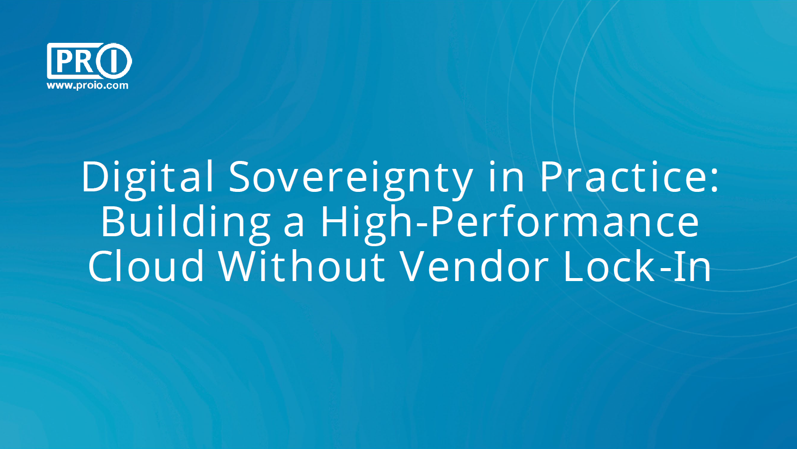](https://www.slideshare.net/slideshow/digital-sovereignty-in-practice-building-a-high-performance-cloud-without-vendor-lock-in-swen-bruseke/287804119)

##### LINSTOR as CloudStack Primary Storage: From Theory to Production War Stories – [Rene Peinthor]( https://www.linkedin.com/in/rene-peinthor-588b50339/), [LINBIT]( https://linbit.com/)

Rene Peinthor introduced LINSTOR-SDS before diving into real-world production challenges, operational lessons, and practical strategies for avoiding common pitfalls when deploying LINSTOR with CloudStack.

[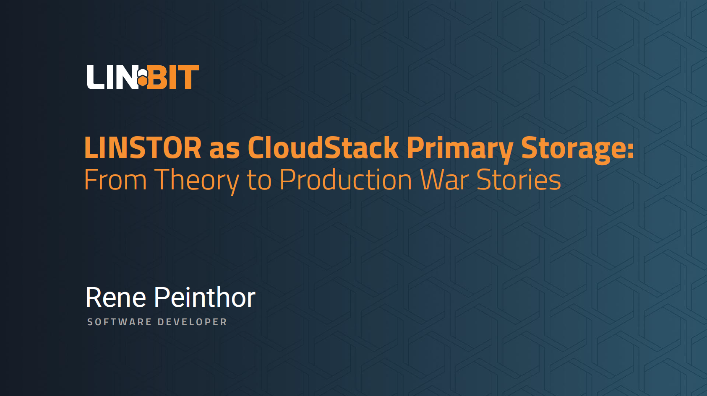](https://www.slideshare.net/slideshow/linstor-as-cloudstack-primary-storage-from-theory-to-production-war-stories-rene-peinthor/287784333)

##### Kubernetes Is Not the New VM: Choosing the Right Abstraction for Modern Infrastructure – [Stoil Sotilov]( https://www.linkedin.com/in/stoil-stoilov/), [StorPool Storage](https://storpool.com/)

In this session, Stoil Sotilov challenged the common assumption that Kubernetes replaces virtual machines.

Instead, the talk presented a practical framework for deciding when to use Kubernetes and when virtual machines remain the better choice — particularly in CloudStack environments. The session explored differences in isolation, lifecycle management, networking, and operational complexity, while highlighting real-world scenarios where each technology performs best.

[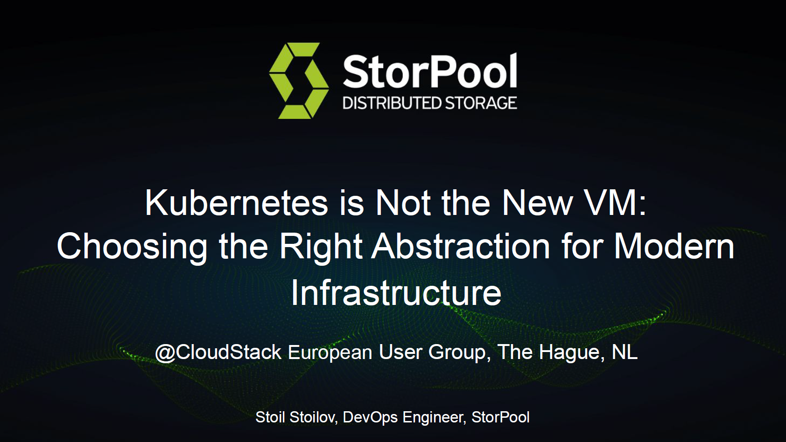](https://www.slideshare.net/slideshow/kubernetes-is-not-the-new-vm-choosing-the-right-abstraction-for-modern-infrastructure-stoil-stoilov/287784343)

##### Safeguarding Apache CloudStack – Data Protection & Recovery Powered by Commvault – [Marc De Schepper]( https://www.linkedin.com/in/deschepperm/), [Commvault](https://www.commvault.com/)

Marc De Schepper demonstrated how Commvault enhances Apache CloudStack with enterprise-grade data protection and recovery capabilities.

The session provided insight into Commvault’s broader portfolio while showcasing strategies for building cyber resilience through practical implementation blueprints and live demonstrations.

[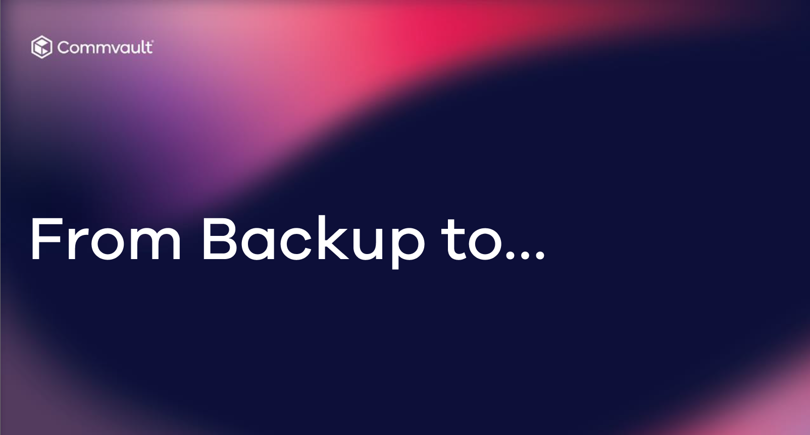](https://www.slideshare.net/slideshow/safeguarding-apache-cloudstack-data-protection-recovery-powered-by-commvault-marc-de-schepper/287821425)

##### CloudStack Multisite Networking – [Noa Omer](https://www.linkedin.com/in/noa-omer/), [Cyso Group](https://www.linkedin.com/company/cyso-group/)

Noa Omer presented how Cyso Cloud deploys Apache CloudStack to establish multisite networking across two geographically distributed regions.

The presentation covered cross-region zone interconnectivity, network fabric design, and routing configuration, alongside an honest discussion of operational complexities, challenges, and outcomes.

[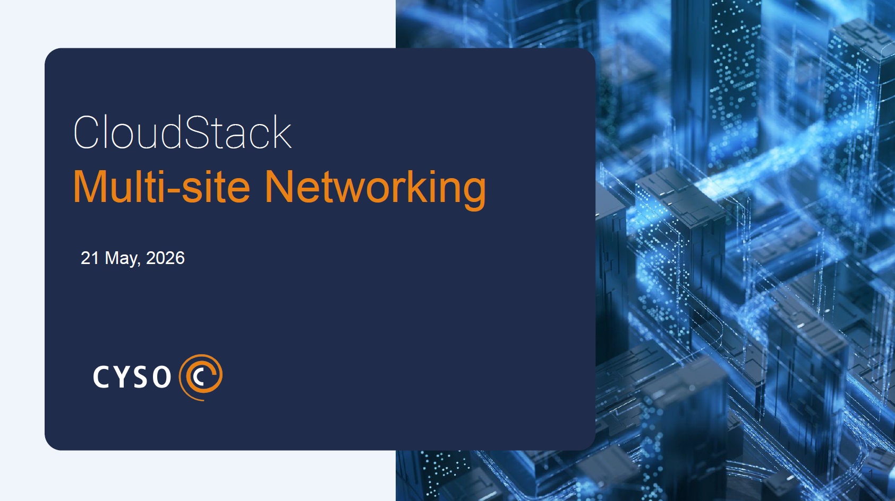](https://www.slideshare.net/slideshow/cloudstack-multisite-networking-noa-omer/287784387)

##### From VMware to CloudStack/KVM: A Structured Migration Strategy with Minimal Downtime – [Ingo Jochim]( https://www.linkedin.com/in/ingo-jochim/) & [Prashanth Reddy]( https://www.linkedin.com/in/prashanth-m-reddy/), ShapeBlue

Ingo Jochim and Prashanth Reddy presented a practical and structured approach to migrating from VMware to Apache CloudStack with KVM.

As organizations increasingly look to reduce vendor lock-in and regain infrastructure control, the session explored the full migration lifecycle — from environment discovery and planning to testing and large-scale execution.

A key focus was minimizing downtime through techniques such as warm migration, pre-staged bulk data transfer, and short cutover windows using delta synchronization.

[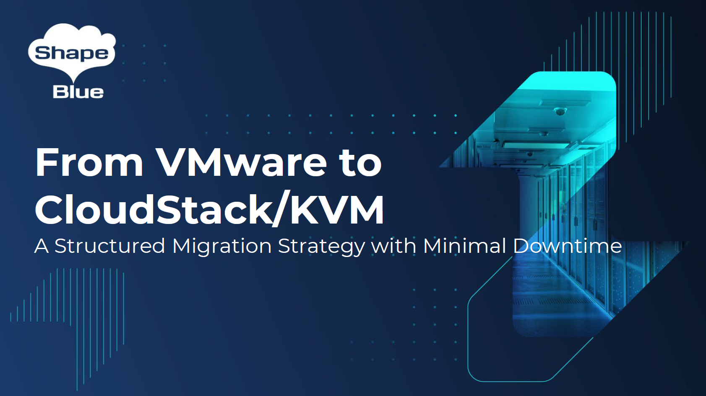](https://www.slideshare.net/slideshow/from-vmware-to-cloudstack-kvm-a-structured-migration-strategy-with-minimal-downtime-ingo-jochim-prashath-reddy/287784396)

##### CBS – Our CloudStack Journey – Abdurrahman Ali & [Perry Smolenaars]( https://www.linkedin.com/in/psmolenaars/?originalSubdomain=nl), CBS

The event concluded with Abdurrahman Ali and Perry Smolenaars sharing the CloudStack journey of Statistics Netherlands.

They discussed when and why CBS decided to adopt Apache CloudStack, the challenges encountered along the way, and the benefits the organization has achieved through its open-source cloud strategy.

[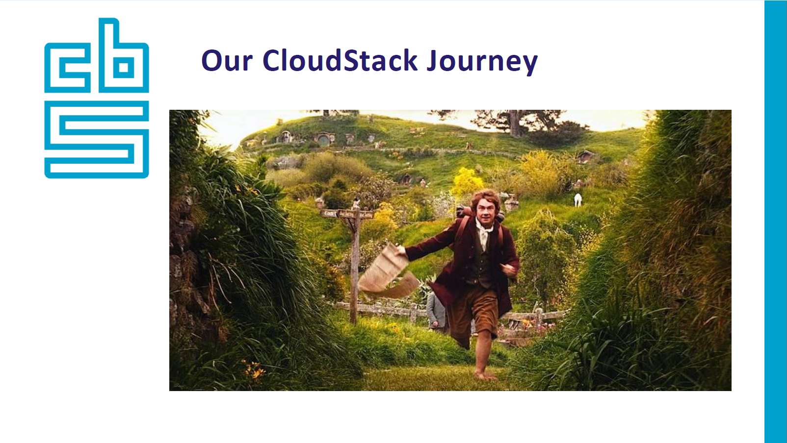](https://www.slideshare.net/slideshow/our-cloudstackjourney-abdurrahman-ali-perry-smolenaars-cbs/287804185)

A big thank you the hosts and a sponsor of the event – [CBS – Statistcks Netherlands]( https://www.cbs.nl/en-gb) and to [ShapeBlue](https://shapeblue.com) and [Cyso Group]( https://cyso.com/en/) for supporting the event. All the organisers, sponsors, speakers, and participants made this gathering a significant success.
The next major gathering for the community is the CloudStack Collaboration Conference—the largest CloudStack event of the year—happening on 18–20 November in Edinburgh. We invite everyone to join us there and be part of the community.

  <a class="button button--primary" href="https://www.eventbrite.com/e/cloudstack-collaboration-conference-2026-tickets-1975705589603?aff=oddtdtcreator" target="_blank">Register now</a>

 
