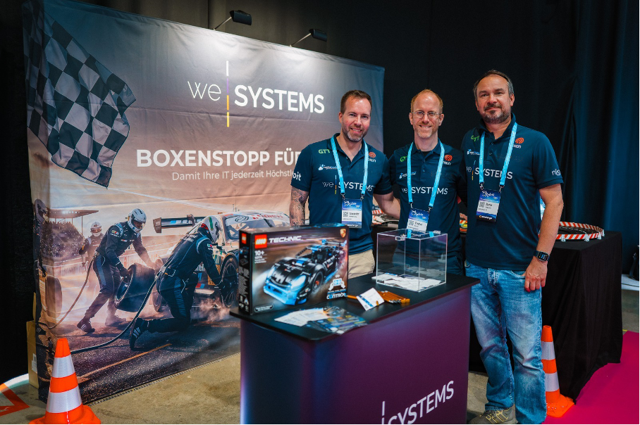
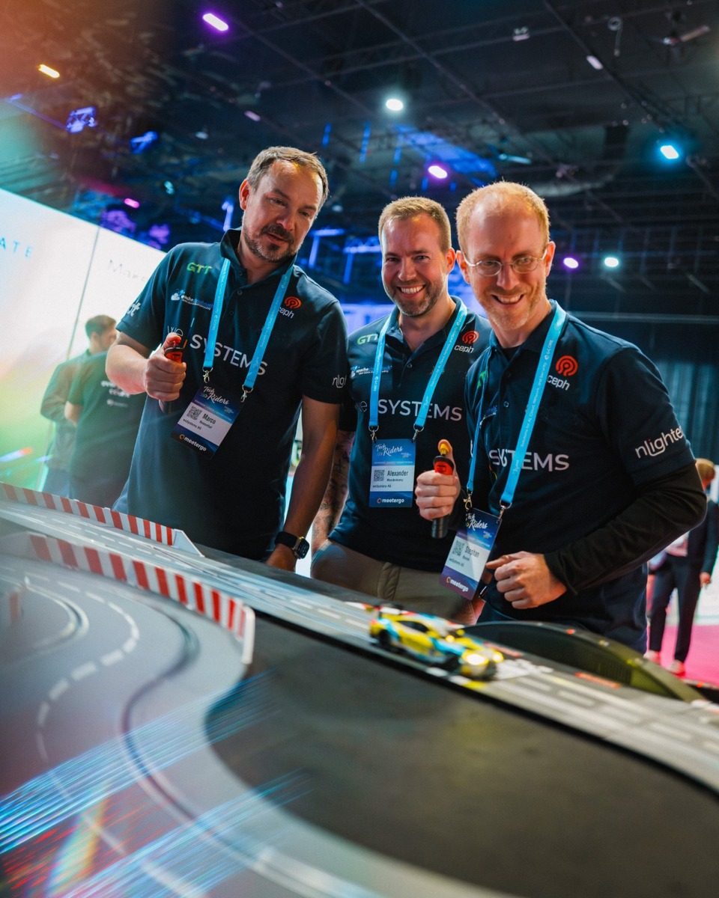

A guest post by [Alexander Monderkamp](https://www.linkedin.com/in/alexander-monderkamp-a1a9b4171/), weSystems

## A logo on a T-shirt and what it stands for
At this year's TechRiders Festival in Hürth, Germany, three people
walked around a tech event in polo shirts carrying the Apache
CloudStack logo. Not as a statement. Not as a marketing move. Simply
because it is part of who they are and what they do every day.

<!-- truncate -->

But why does a managed services provider and cloud operator wear open
source on its sleeve, literally and professionally? The answer starts
with a technology decision weSystems made years ago and have never had
reason to revisit. Read their full story and engagement with the
CloudStack project in their own words below!

## How weSystems got there?

weSystems is an IT infrastructure and managed services provider based
in Germany. We build and operate infrastructure for mid-sized and
larger companies, running our own cloud out of certified German data
centers. When we set out to build that cloud, we had a fundamental
question to answer: which technology do we trust to run it?

We chose Apache CloudStack. Not because it was the most talked-about
option at the time, but because it was the right one for what we
needed to build. That was several years ago. The decision has held up
ever since.

## The thing that actually matters: multi-tenancy done right

There are many things to appreciate about Apache CloudStack, but if we
had to name the single most important reason it powers our cloud, it
would be its multi-tenancy architecture.

We operate infrastructure for multiple customers simultaneously. Those
customers must never see each other, interfere with each other or
share resources in ways they have not explicitly agreed to. In a
managed cloud environment, that isolation is not a nice-to-have. It is
the foundation on which trust is built.

CloudStack handles this elegantly. Each customer operates within a
fully isolated environment. The boundaries are real, not cosmetic. And
the overhead of managing those boundaries does not fall on us in ways
that would make the whole operation brittle or expensive to run.

This is worth saying explicitly because not every platform gets this
right. Some alternatives that often come up in conversations,
including Proxmox, are excellent tools for certain use cases but were
not designed with true multi-tenancy in mind. Running multiple
isolated customer environments on them requires workarounds that
introduce complexity and risk. With CloudStack, multi-tenancy is not a
workaround. It is built into the architecture.

## Open source as infrastructure philosophy
Beyond the technical capabilities, there is something else that
matters to us about Apache CloudStack, and it connects to a
conversation that is increasingly relevant in the European IT
landscape.

Digital sovereignty is not only about where your data is stored. It is
also about which software runs your infrastructure and who controls
its future. Proprietary platforms come with roadmaps you cannot
influence, licensing models that can change and dependencies that are
difficult to exit. Open source turns that equation around.

With Apache CloudStack, we can read the code, understand exactly what
it does, contribute to its development and adapt it where our
customers' needs require it. We are not dependent on a single vendor's
decisions about which features get built or which customers get
priority support. The community decides together, and the code is
transparent.

For a company that has built its reputation on being a trustworthy,
independent partner rather than a product reseller, that philosophy
resonates deeply. We tell our customers they should avoid
infrastructure decisions that leave them locked in and unable to
change course. It would be inconsistent to build our own cloud on a
foundation that does exactly that.

## What we have learned over the years
Running Apache CloudStack in production for multiple customers over
many years has given us a level of familiarity with the platform that
goes beyond documentation. We have learned where it excels, where it
requires care and where the community's collective knowledge is the
most valuable resource available.

We have also learned that the knowledge concentrated in the CloudStack
community is genuinely rare. The people who work with this platform
seriously tend to understand infrastructure at a depth that broader
cloud conversations often skip past. That is part of why events and
community touchpoints matter, and part of why we show up to a
motorsport-themed tech festival with the logo on our shirts.

## Why we think more companies should know about this
Apache CloudStack rarely gets the marketing budget that some of its
alternatives enjoy. It does not have a large commercial entity pushing
it into every conference keynote. What it has is a community of
operators who have chosen it because it solves real problems well.

For European companies thinking carefully about their infrastructure
choices, particularly those who care about sovereignty, auditability
and avoiding lock-in, it deserves far more attention than it typically
gets. The technology is mature, the architecture is sound and the
community is the kind that answers real questions with real
experience.

We are glad to be part of it. And we will keep wearing the logo.

## About weSystems
weSystems is an IT infrastructure and managed services provider
operating their own German cloud in certified German data
centers. They build, operate and support infrastructure for mid-sized
and enterprise customers who value reliability, independence and a
partner that picks up the phone.
