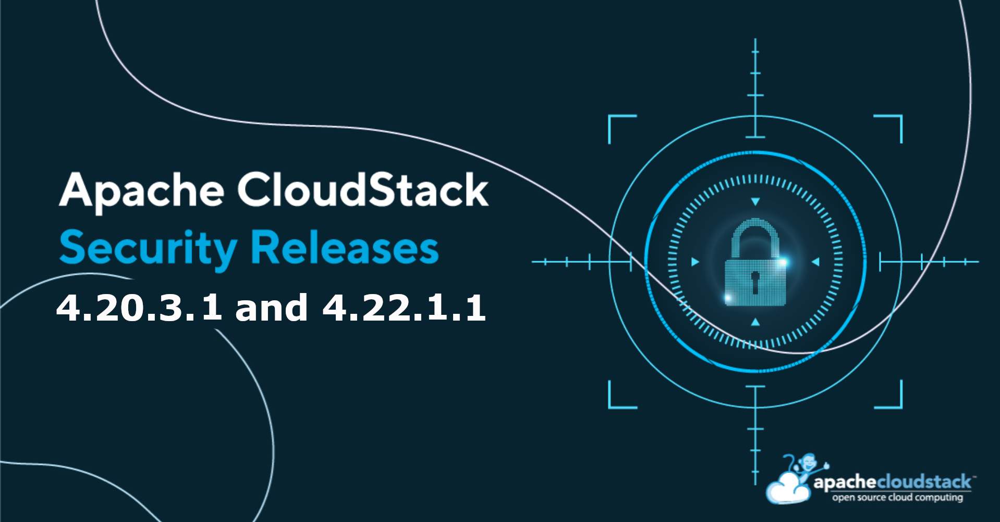

The Apache CloudStack project announces the release of LTS releases [4.20.3.1](https://github.com/apache/cloudstack/releases/tag/4.20.3.1) and [4.22.1.1](https://github.com/apache/cloudstack/releases/tag/4.22.1.1) that address the following security issues:

- CVE-2026-47359 (severity 'Low')
- CVE-2026-50112 (severity 'Critical')
- CVE-2026-50222 (severity 'Important')
- CVE-2026-59085 (severity 'Moderate')
- CVE-2026-59654 (severity 'Medium')
- CVE-2026-59655 (severity 'Moderate')
- CVE-2026-59657 (severity 'Low')
- CVE-2026-59780 (severity 'Low')
- CVE-2026-59799 (severity 'Important')
- CVE-2026-61397 (severity 'Critical')
- CVE-2026-61398 (severity 'Low')
- CVE-2026-61399 (severity 'Low')
- CVE-2026-61400 (severity 'Low')
- CVE-2026-61422 (severity 'Low')
- CVE-2026-62440 (severity 'Important')
- CVE-2026-65613 (severity 'Moderate')
- CVE-2026-66721 (severity 'Moderate')
- CVE-2026-66722 (severity 'Moderate')
- CVE-2026-66797 (severity 'Low')
- CVE-2026-68745 (severity 'Important')

<!-- truncate -->

## [CVE-2026-47359](https://www.cve.org/CVERecord?id=CVE-2026-47359): OS Command Injection due to unsanitized mount command

Improper Neutralization of Special Elements used in an OS Command ('OS
Command Injection') vulnerability in Apache CloudStack's NAS backup
provider plugin. The addBackupRepository API (available since
4.20.0.0) and updateBackupRepository API (introduced in 4.22.0.0)
accept unsanitized command options for the backup repository. A
malicious operator account can exploit this to inject arbitrary
commands that execute on the KVM hypervisor host when any account
subsequently performs a backup restore.

### Credits

The CVEs are credited to the following reporters:

 - 김우석 <wooseokdotkim@gmail.com> (reporter)
 - Łukasz Bawolski <Lukasz.Bawolski@exea.pl> (reporter)

### Affected versions:

  - Apache CloudStack 4.20.0.0 through 4.20.3.0
  - Apache CloudStack 4.21.0.0 through 4.22.1.0

### Resolution

Users are recommended to upgrade to versions 4.20.3.1 or 4.22.1.1 or later, which
addresses these issues.

## [CVE-2026-50112](https://www.cve.org/CVERecord?id=CVE-2026-50112): RCE and SSRF in direct download, metalink and NFS templates

##### SSRF via Metalink Mirror URL Resolution:

An authenticated tenant can register a template pointing to an
attacker-controlled metalink file containing internal targets. The
Secondary Storage VM will retrieve the data and persist it as a
template file, which can later be downloaded through normal APIs.

##### RCE on KVM hypervisor via NFS, Metalink files with/without Direct Downloads:

An authenticated CloudStack tenant holding the default User role can
execute arbitrary shell commands as root on the KVM hypervisor host
that runs other tenants' VMs. This is cross-tenant root on the
underlying compute, reachable via the public CloudStack API.

When a User registers a VM template with directDownload=true and a URL
pointing to a .metalink file, the management server fetches the
metalink XML and dispatches download to the KVM agent. Inner URLs
inside the metalink XML are never re-validated against the scheme
allowlist.

### Credits

The CVEs are credited to the following reporters:

 -  K (reporter)
 -  Samy Ghannad <samy@samyghannad.com> (reporter)
 -  Katriel Moses <katriel.moses@gmail.com> (reporter)
 -  Venkatraman Kumar <venkatraman.kumar@securin.io> (reporter)
 -  Łukasz Bawolski <Lukasz.Bawolski@exea.pl> (reporter)

### Affected versions:

  - Apache CloudStack 4.14.0.0 through 4.20.3.0
  - Apache CloudStack 4.21.0.0 through 4.22.1.0

### Resolution

Users are recommended to upgrade to versions 4.20.3.1 or 4.22.1.1 or later, which
addresses these issues.

## [CVE-2026-50222](https://www.cve.org/CVERecord?id=CVE-2026-50222): Improper access control in Userdata reference APIs

Missing Authorization, Exposure of Sensitive Information to an
Unauthorized Actor vulnerability in Apache CloudStack's Userdata
reference APIs.

Several userdata-related APIs in Apache CloudStack, including
deleteUserData, linkUserDataToTemplate,
resetUserDataForVirtualMachine, deployVirtualMachine, and
updateVirtualMachine, exhibit missing or insufficient access control
validation, potentially allowing cross-tenant/cross-account access to
userdata resources that belong to other tenants.

The deleteCniConfiguration API, introduced in 4.21.0.0, also exhibits
similar behaviour and lacks access validation.

### Credits

The CVEs are credited to the following reporters:

 - Bernardo De Marco Gonçalves <bernardomg2004@gmail.com> (reporter)
 - Yuliang Xiao <xyl1509410143@outlook.com> (reporter)
 - Łukasz Bawolski <Lukasz.Bawolski@exea.pl> (reporter)
 - George Chen (GitHub: geo-chen) (reporter)
 - KQ Wu <kqmailbox@163.com> (reporter)

### Affected versions:

  - Apache CloudStack 4.18.0.0 through 4.20.3.0
  - Apache CloudStack 4.21.0.0 through 4.22.1.0

### Resolution

Users are recommended to upgrade to versions 4.20.3.1 or 4.22.1.1 or later, which
addresses these issues.

## [CVE-2026-59085](https://www.cve.org/CVERecord?id=CVE-2026-59085): Server-Side Request Forgery (SSRF) vulnerability in webhook module

Server-Side Request Forgery (SSRF) vulnerability in Apache
CloudStack's webhook module, exploitable via webhook delivery
requests.

### Credits

The CVEs are credited to the following reporters:

 - Jonathan Leitschuh <jonathan.leitschuh@gmail.com> (reporter)
 - Łukasz Bawolski <Lukasz.Bawolski@exea.pl> (reporter)
 - George Chen (GitHub: geo-chen) (reporter)

### Affected versions:

  - Apache CloudStack 4.20.0.0 through 4.20.3.0
  - Apache CloudStack 4.21.0.0 through 4.22.1.0

### Resolution

Users are recommended to upgrade to versions 4.20.3.1 or 4.22.1.1 or later, which
addresses these issues.

## [CVE-2026-59654](https://www.cve.org/CVERecord?id=CVE-2026-59654): DoS caused by database connections leak

Missing Release of Resource after Effective Lifetime vulnerability in
Apache CloudStack's scoped global configuration functionality. It
affects different modules and plugins of the CloudStack management
server, including Quota, Host-HA, etc., and may lead to eventual
denial of service (DoS) scenario for the management server.

### Credits

The CVEs are credited to the following reporters:

 - Henrique Sato <henriquesato2003@gmail.com> (reporter)

### Affected versions:

  - Apache CloudStack 4.7.0 through 4.20.3.0
  - Apache CloudStack 4.21.0.0 through 4.22.1.0

### Resolution

Users are recommended to upgrade to versions 4.20.3.1 or 4.22.1.1 or later, which
addresses these issues.

## [CVE-2026-59655](https://www.cve.org/CVERecord?id=CVE-2026-59655): Unauthenticated OAuth provider client-secret disclosure

Exposure of Sensitive Information to an Unauthorized Actor
vulnerability in Apache CloudStack's OAuth authentication plugin while
listing OAuth providers.

### Credits

The CVEs are credited to the following reporters:

 - Yuliang Xiao <xyl1509410143@outlook.com> (reporter)
 - Stijn Simons <stijn.simons@portofantwerpbruges.com> (reporter)

### Affected versions:

  - Apache CloudStack 4.19.0.0 through 4.20.3.0
  - Apache CloudStack 4.21.0.0 through 4.22.1.0

### Resolution

Users are recommended to upgrade to versions 4.20.3.1 or 4.22.1.1 or later, which
addresses these issues.

## [CVE-2026-59657](https://www.cve.org/CVERecord?id=CVE-2026-59657): Sensitive Information Disclosure via Cleartext Storage in AsyncJob

Cleartext Storage of Sensitive Information vulnerability in Apache
CloudStack with AsyncJob storage in the database.

### Credits

The CVEs are credited to the following reporters:

 - Davi Torres <davift@gmail.com> (reporter)

### Affected versions:

  - Apache CloudStack 4.0.0 through 4.20.3.0
  - Apache CloudStack 4.21.0.0 through 4.22.1.0

### Resolution

Users are recommended to upgrade to versions 4.20.3.1 or 4.22.1.1 or later, which
addresses these issues.

## [CVE-2026-59780](https://www.cve.org/CVERecord?id=CVE-2026-59780): LDAP provider configuration disclosure

Exposure of Sensitive Information to an Unauthorized Actor
vulnerability in Apache CloudStack's LDAP authentication plugin while
listing LDAP providers.

LDAP configurations can be listed by any authenticated user with
access to the listLdapConfigurations API. By default, this API is
available to all default roles.

### Credits

The CVEs are credited to the following reporters:

 - Łukasz Bawolski <Lukasz.Bawolski@exea.pl> (reporter)

### Affected versions:

  - Apache CloudStack 4.2.0.0 through 4.20.3.0
  - Apache CloudStack 4.21.0.0 through 4.22.1.0

### Resolution

Users are recommended to upgrade to versions 4.20.3.1 or 4.22.1.1 or later, which
addresses these issues.

## [CVE-2026-59799](https://www.cve.org/CVERecord?id=CVE-2026-59799): Missing Privilege Check in Two-Factor Authentication Disable Flow

Improper Privilege Management vulnerability in Apache CloudStack's
Two-factor authentication plugin allowing bypass of the two-factor
authentication disable flow.

### Credits

The CVEs are credited to the following reporters:

 - Erichen <chenyoulong20g@ict.ac.cn> (reporter)

### Affected versions:

  - Apache CloudStack 4.18.0.0 through 4.20.3.0
  - Apache CloudStack 4.21.0.0 through 4.22.1.0

### Resolution

Users are recommended to upgrade to versions 4.20.3.1 or 4.22.1.1 or later, which
addresses these issues.

## [CVE-2026-61397](https://www.cve.org/CVERecord?id=CVE-2026-61397): OAuth2 Token Cross-Request Leak

Exposure of Sensitive Information to an Unauthorized Actor
vulnerability in Apache CloudStack's OAuth2 authentication plugin and
Google OAuth integration.

### Credits

The CVEs are credited to the following reporters:

 - Katriel Moses <katriel.moses@gmail.com> (reporter)
 - "Network and Cloud Laboratory (NaCl) KMITL" <nacl@kmitl.ac.th> (reporter)
 - Paratpanu Pechsaman <66010542@kmitl.ac.th> (analyst)
 - Nutthawat Charoensiriphong <68010321@kmitl.ac.th> (analyst)
 - Panabordee Panitchakit <68010697@kmitl.ac.th> (analyst)

### Affected versions:

  - Apache CloudStack 4.19.0.0 through 4.20.3.0
  - Apache CloudStack 4.21.0.0 through 4.22.1.0

### Resolution

Users are recommended to upgrade to versions 4.20.3.1 or 4.22.1.1 or later, which
addresses these issues.

## [CVE-2026-61398](https://www.cve.org/CVERecord?id=CVE-2026-61398): Cross-Site Scripting (XSS) Vulnerability in Instance Reset Password Function in UI

Improper Encoding or Escaping of Output vulnerability in Apache
CloudStack's UI while using Instance Reset Password functionality.

### Credits

The CVEs are credited to the following reporters:

 - Łukasz Bawolski <Lukasz.Bawolski@exea.pl> (reporter)

### Affected versions:

  - Apache CloudStack 4.15.1.0 through 4.20.3.0
  - Apache CloudStack 4.21.0.0 through 4.22.1.0

### Resolution

Users are recommended to upgrade to versions 4.20.3.1 or 4.22.1.1 or later, which
addresses these issues.

## [CVE-2026-61399](https://www.cve.org/CVERecord?id=CVE-2026-61399): Cross-Site Scripting (XSS) Vulnerability in Lock User Function in UI

Improper Encoding or Escaping of Output vulnerability in Apache
CloudStack's UI while using Lock User Functionality.

### Credits

The CVEs are credited to the following reporters:

 - Łukasz Bawolski <Lukasz.Bawolski@exea.pl> (reporter)

### Affected versions:

  - Apache CloudStack 4.20.0.0 through 4.20.3.0
  - Apache CloudStack 4.21.0.0 through 4.22.1.0

### Resolution

Users are recommended to upgrade to versions 4.20.3.1 or 4.22.1.1 or later, which
addresses these issues.

## [CVE-2026-61400](https://www.cve.org/CVERecord?id=CVE-2026-61400): Get and Run Diagnostics Command Injection

Improper Neutralization of Special Elements used in a Command
('Command Injection') vulnerability in Apache CloudStack's run and get
diagnostics functionality for the system VMs and virtual routers.

An authenticated user holding the permissions required to invoke
either `getDiagnosticsData` or `runDiagnostics` can achieve arbitrary
command execution on the system VM and/or Virtual Router instances,
with commands running as root (or as the diagnostics-process user, at
minimum). This represents a full compromise of the affected instance
and, depending on network segmentation, may provide a foothold for
lateral movement within the CloudStack-managed infrastructure,
including access to guest network traffic handled by the compromised
Virtual Router.

The getDiagnosticsData and runDiagnostics APIs are restricted to only
Admin role accounts by default.

### Credits

The CVEs are credited to the following reporters:

 - Łukasz Bawolski <Lukasz.Bawolski@exea.pl> (reporter)

### Affected versions:

  - Apache CloudStack 4.14.0.0 through 4.20.3.0
  - Apache CloudStack 4.21.0.0 through 4.22.1.0

### Resolution

Users are recommended to upgrade to versions 4.20.3.1 or 4.22.1.1 or later, which
addresses these issues.

## [CVE-2026-61422](https://www.cve.org/CVERecord?id=CVE-2026-61422): Authenticated pre-validation SSRF in registerTemplate

Authenticated pre-validation SSRF vulnerability in Apache CloudStack's
template and ISO registration functionality.

When registering a template or ISO, CloudStack makes a live HTTP
HEAD/GET call to determine file size for secondary storage usage-limit
checks, and this happens before URL validation is performed. However,
this does not pose a malicious template or ISO registration risk, as
URL validation still occurs prior to the actual download by the
Secondary Storage VM.

### Credits

The CVEs are credited to the following reporters:

 - Yuliang Xiao <xyl1509410143@outlook.com> (reporter)

### Affected versions:

  - Apache CloudStack 4.20.3.0
  - Apache CloudStack 4.21.0.0 through 4.22.1.0

### Resolution

Users are recommended to upgrade to versions 4.20.3.1 or 4.22.1.1 or later, which
addresses these issues.

## [CVE-2026-62440](https://www.cve.org/CVERecord?id=CVE-2026-62440): Improper access control in Kubernetes Service (CKS) cluster manipulation

Improper Access Control vulnerability in Apache CloudStack's
Kubernetes Service (CKS) plugin, allowing cross-tenant manipulation of
the Kubernetes cluster while adding and removing nodes.

### Credits

The CVEs are credited to the following reporters:

 - George Chen (GitHub: geo-chen) (reporter)
 - D0HY30N (GitHub: D0HY30N) (reporter)

### Affected versions:

  - Apache CloudStack 4.21.0.0 through 4.22.1.0

### Resolution

Users are recommended to upgrade to versions 4.22.1.1 or later, which
addresses these issues.

## [CVE-2026-65613](https://www.cve.org/CVERecord?id=CVE-2026-65613): Webhook Deliveries Incorrect Access

Exposure of Sensitive Information to an Unauthorized Actor
vulnerability in Apache CloudStack's Webhook module while listing and
deleting deliveries.

### Credits

The CVEs are credited to the following reporters:

 - Łukasz Bawolski <Lukasz.Bawolski@exea.pl> (reporter)

### Affected versions:

  - Apache CloudStack 4.20.0.0 through 4.20.3.0
  - Apache CloudStack 4.21.0.0 through 4.22.1.0

### Resolution

Users are recommended to upgrade to versions 4.20.3.1 or 4.22.1.1 or later, which
addresses these issues.

## [CVE-2026-66721](https://www.cve.org/CVERecord?id=CVE-2026-66721): Authorization issue with listHostTags for domain admins

Missing authorization issue for domain admins in CloudStack's host
tags listing functionality.

Domain Admins, by default, have permission to call the listHostTags
API, but the API returns host tags for every host in the environment
without domain scoping. It should instead be restricted to only the
hosts dedicated to that admin's domain.

### Credits

The CVEs are credited to the following reporters:

 - KQ Wu <kqmailbox@163.com> (reporter)

### Affected versions:

  - Apache CloudStack 4.12.0.0 through 4.20.3.0
  - Apache CloudStack 4.21.0.0 through 4.22.1.0

### Resolution

Users are recommended to upgrade to versions 4.20.3.1 or 4.22.1.1 or later, which
addresses these issues.

## [CVE-2026-66722](https://www.cve.org/CVERecord?id=CVE-2026-66722): ProjectRole & ProjectRolePermission authorization issue

Improper authorization for CRUD operations on Project Roles and
Project Role permissions for domain admins in CloudStack.

A Domain Admin can create, update, delete, and list project roles and
project role permissions for projects in any domain, not just their
own. The check only confirms the caller is a Domain Admin, without
verifying whether the target project belongs to their domain or
subdomain. This allows a malicious Domain Admin to tamper with project
roles and permissions across unrelated domains.

### Credits

The CVEs are credited to the following reporters:

 - KQ Wu <kqmailbox@163.com> (reporter)

### Affected versions:

  - Apache CloudStack 4.15.0.0 through 4.20.3.0
  - Apache CloudStack 4.21.0.0 through 4.22.1.0

### Resolution

Users are recommended to upgrade to versions 4.20.3.1 or 4.22.1.1 or later, which
addresses these issues.

## [CVE-2026-66797](https://www.cve.org/CVERecord?id=CVE-2026-66797): Unauthorised comment creation and disclosure

Improper access control in CloudStack's annotation functionality
allows unauthorized comment creation and disclosure.

The addAnnotation and listAnnotation APIs perform an ownership check
when an entity's UUID is specified, but fail to honor its result
correctly. This lets any authenticated user write annotations to, and
disclose existing annotations/comments on, an entity they don't own by
simply supplying its UUID.

### Credits

The CVEs are credited to the following reporters:

 - Łukasz Bawolski <lukasz.bawolski@exea.pl> (reporter)

### Affected versions:

  - Apache CloudStack 4.16.0.0 through 4.20.3.0
  - Apache CloudStack 4.21.0.0 through 4.22.1.0

### Resolution

Users are recommended to upgrade to versions 4.20.3.1 or 4.22.1.1 or later, which
addresses these issues.

## [CVE-2026-68745](https://www.cve.org/CVERecord?id=CVE-2026-68745): SAML2 Signature Validation Silently Skipped for Cert-less IdP

Certificate validation failures in SAML authentication in Apache
CloudStack 4.20.3.0 and 4.22.1.0 on all platforms allow a malicious
agent to forge a SAML response to the management server. The agent
will have to spoof the ip address of the IdP or get an url of its own
choosing registered in the management server, after which it can allow
logging on with forged signatures.

### Credits

The CVEs are credited to the following reporters:

 - Katriel Moses <katriel.moses@gmail.com> (reporter)

### Affected versions:

  - Apache CloudStack 4.5.2 through 4.20.3.0
  - Apache CloudStack 4.21.0.0 through 4.22.1.0

### Resolution

Users are recommended to upgrade to versions 4.20.3.1 or 4.22.1.1 or later, which
addresses these issues.

## Downloads and Documentation

The official source code for the 4.20.3.1 and 4.22.1.1 releases can be downloaded
from the project downloads page:

https://cloudstack.apache.org/downloads

The 4.22.1.1 release notes can be found at:
- https://docs.cloudstack.apache.org/en/4.22.1.1/releasenotes/about.html

In addition to the official source code release, individual
contributors have also made release packages available on the Apache
CloudStack download page, and available at:

- https://download.cloudstack.org/el/8/
- https://download.cloudstack.org/el/9/
- https://download.cloudstack.org/el/10/
- https://download.cloudstack.org/suse/15/
- https://download.cloudstack.org/debian/dists/
- https://download.cloudstack.org/ubuntu/dists/
- https://www.shapeblue.com/cloudstack-packages/
