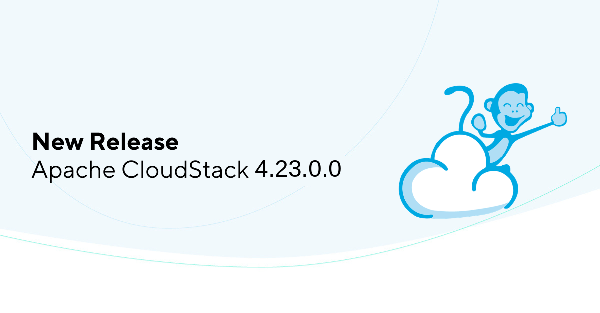

The Apache CloudStack project is pleased to announce the release of CloudStack 4.23.0.0, which is a Regular release.

The CloudStack 4.23 release is the most recent release of the cloud management platform. It comes as a product of extensive contributions from the project development community.

The 4.23 release contains 9 new features, around 20 improvements and more than 120 bug fixes since the 4.22.0.0 release. Some of the highlights include:

<!-- truncate -->

· CLVM (Clustered LVM) Enhancements for KVM

· Key Management Service (KMS) with HSM Integration

· NetApp ONTAP Primary Storage Support

· KVM Backup on Secondary Storage (KBOSS), a new provider with support for incremental backups, compression, and validation

· Incremental Backup Support for the NAS Backup and Recovery Provider

· Support for Dedicating Backup Offerings to Domains

· Veeam Backup and Recovery Integration for KVM

· Conserve Mode for VPC Offerings

· DNS Framework, with PowerDNS as the first plugin

· DHCP Lease Timeout Support

· MAC Address Reuse Control for Virtual Router Public NICs

· Network Extension: Orchestrate External Network Devices

· Support Firewall Rules on Public IPs in VPC

· Support for Enabling/Disabling NICs on KVM

· API Key Pairs with Limited Permissions and Expiry Dates

· Keycloak OAuth Provider Support

· Per-Domain OAuth Provider Support

· Affinity Group Selection during Kubernetes Cluster Creation

· Headlamp as the New Kubernetes Dashboard (Legacy Dashboard Deprecated)

· Clone Existing Compute/Service Offerings and Update Them

· Flexible JavaScript Rules for Guest OS Allocation

· Quota Plugin Improvements and UI Rework

· Scheduled Min/Max Sizing for VM Autoscaling Groups

· Live Scaling for VMs with Fixed Service Offerings on KVM

· XenServer/XCP-ng 8.3/8.4 vTPM Support

· Several UI fixes and improvements

CloudStack Regular releases are supported only up to the next regular or LTS release and can upgrade to the next releases when they are available.

Apache CloudStack is an open-source software system designed to deploy and manage large networks of virtual machines, as a highly available, highly scalable Infrastructure as a Service (IaaS) cloud computing platform. CloudStack includes an intuitive user interface and rich API for managing the compute, networking software, and storage resources, that allows users to build feature-rich public and private cloud environments. The project became an Apache top-level project in March 2013 and is currently deployed in thousands of organizations globally.

More information about Apache CloudStack can be found at: https://cloudstack.apache.org/

# Documentation

What's new in CloudStack 4.23.0.0: https://docs.cloudstack.apache.org/en/4.23.0.0/releasenotes/about.html

The 4.23.0.0 release notes include a full list of issues fixed, as well as upgrade instructions from previous versions of Apache CloudStack, and can be found at: https://docs.cloudstack.apache.org/en/4.23.0.0/releasenotes/

The official installation, administration, and API documentation for each of the releases are available on our documentation page: https://docs.cloudstack.apache.org/

# Downloads

The official source code for the 4.23.0.0 release can be downloaded from our downloads page:

https://cloudstack.apache.org/downloads.html

In addition to the official source code release, individual contributors have also made convenience binaries available on the Apache CloudStack download page, and can be found at:

https://download.cloudstack.org/el/8/
https://download.cloudstack.org/el/9/
https://download.cloudstack.org/el/10/
https://download.cloudstack.org/suse/15
https://download.cloudstack.org/ubuntu/dists/
https://download.cloudstack.org/debian/dists/
https://www.shapeblue.com/cloudstack-packages/

# A Word from the Community

<em>"We are getting feature releases and LTS releases, and are giving ourselves a structure to work in. In spite of having release security fixes with a lot of issues addressed, we managed to get this packed release out at the same time. A lot of new and/or improved integrations around backup and recovery, a DNS framework, network features, authentication features and integrations, kubernetes improvements as well as core orchestration improvements. This one is packed with cool new stuff that users will want. I am sure I cannot try them all over the coming months and will be playing with the extensions especially."</em>

\- [Daan Hoogland](https://github.com/DaanHoogland), Apache Member, Apache CloudStack PMC Member

 

<em>"Every Apache CloudStack release is an important milestone for our community, and 4.23 is no exception. Although it is a regular release rather than an LTS release, it is held to the same standards of quality and stability as our LTS releases, while bringing a rich set of new features and improvements.  
This release is particularly strong in storage and backup, with CLVM (Clustered LVM) enhancements for KVM giving a solid storage option for users migrating from VMware, NetApp ONTAP joining as a new primary storage option, and incremental backup support added to the NAS provider. It also brings improvements across networking and authentication, along with a meaningful set of security enhancements that give operators stronger options for key management and authentication.  
I'd like to thank all the contributors and committers who worked together to deliver this release. Their continued dedication to quality, stability, and innovation is what keeps the Apache CloudStack project moving forward."</em>

\- [Wei Zhou](https://github.com/weizhouapache), Apache CloudStack PMC Member, 4.23 Release Manager

 

<em>"Apache CloudStack 4.23 is a non-LTS release focused on introducing new features and improving existing functionality across the platform. This release brings new primary storage options for KVM, as well as significant additions to the Backup and Recovery module, such as incremental backups through the KBOSS and NAS plugins, compression and validation with KBOSS, and Veeam integration for KVM. The network module also received some very interesting additions, including a PowerDNS integration and support for orchestrating external network devices. On the authentication/authorization side, users can now have multiple API key pairs with limited permissions and expiration dates, and Keycloak has been added as an OAuth provider. Furthermore, the Quota UI has been completely reworked, and we also had many other improvements and bug fixes in various modules."</em>

\- [Fabricio Duarte](https://www.linkedin.com/in/fabricio-duarte-junior/), Apache CloudStack PMC Member, 4.23 Co-Release Manager

