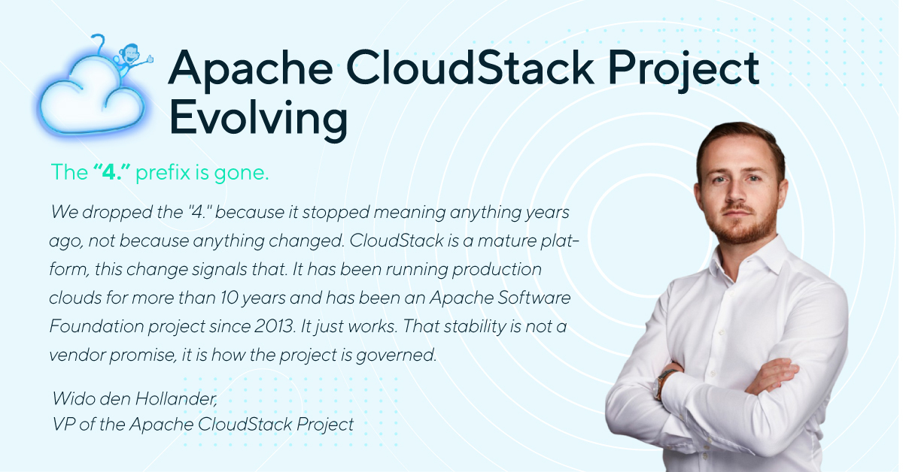

The Apache CloudStack project is changing how it numbers releases. The release
that would have been 4.24 will be released as 24. The "4." prefix is gone.

<!-- truncate -->

## What changes

- The next feature release is 24, with the full version 24.0.0
- Maintenance releases on that branch become 24.1.0, 24.2.0, and so on
- Feature releases after that become 25, 26, 27
- The branch is called 24, packages and tarballs will say 24.0.0

## What does not change

- 4.23 is not affected. It was released as planned under the old scheme
- The release cadence stays the same
- The LTS policy stays the same
- The branching and release process stays the same
- The backwards compatibility guarantees stay the same

Dropping the "4." is not a signal that 24 breaks APIs or brings disruptive
changes. It is a naming change and nothing else.

## Why

The leading "4." has not meant anything for years. We have not had a 5.0, and
there was never a plan for one. In practice everybody already talks about "4.20"
as twenty, and about "4.22" as twenty two. The docs, the branch names, the
release notes and the mailing list all work that way.

So the version we publish now matches the version people actually use. It also
removes a question that kept coming back, which is what a major version bump
would even mean for CloudStack.

>“We dropped the "4." because it stopped meaning anything years ago, not
>because anything changed. CloudStack is a mature platform, this change signals
>that. It has been running production clouds for more than 10 years and has
>been an Apache Software Foundation project since 2013. It just works. That
>stability is not a vendor promise, it is how the project is governed.”
>
>-Wido den Hollander, PMC Member, Apache CloudStack

## What you may need to check

- If you have tooling, scripts or monitoring that parses the CloudStack version
  and assumes it starts with "4.", update it. A version can now be three
  numbers, such as 24.0.0
- Repository paths and package names will use 24.x once 24.0.0 is out
- The upgrade path itself is unchanged. Upgrading from 4.23 to 24 works the same
  way any other upgrade does

## How this was decided

This was a vote on the dev@cloudstack.apache.org mailing list. It opened on 14
August 2026, closed on 21 August 2026, and passed by lazy majority with four
binding votes in favour, one non binding vote in favour, one abstention and one
against.

You can read the full thread here:
[VOTE Version naming: drop the "4." prefix starting with release 24](http://www.mail-archive.com/dev@cloudstack.apache.org/msg107393.html)

The version change has been made on the main branch. We will also talk about it
at the CloudStack Collaboration Conference in November, so there is a chance to
ask questions in person.

If anything is unclear, ask on the users or dev mailing list. We would rather
answer it now than have people confused about which release they are running.
