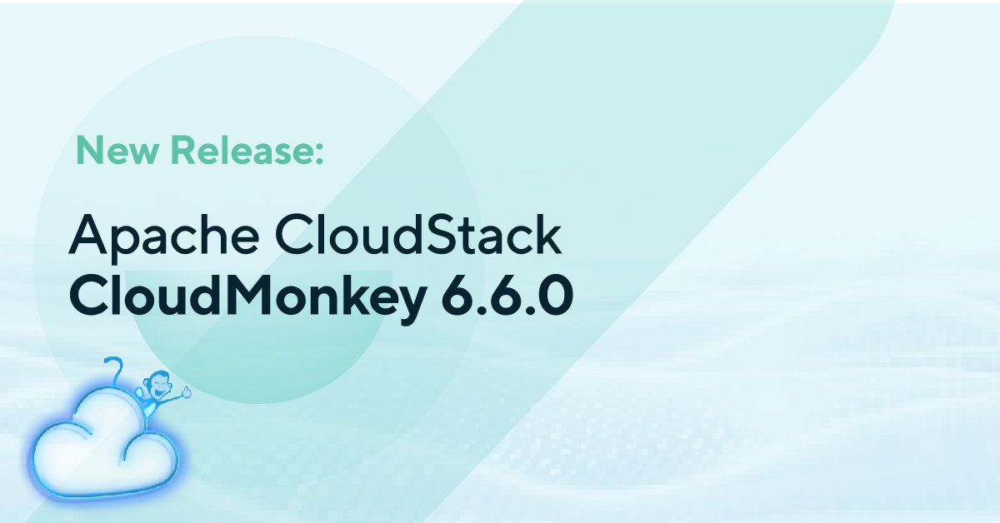

We are pleased to announce the release of Apache CloudStack CloudMonkey v6.6.0,
the latest version of the popular command-line interface tool for managing
Apache CloudStack environments.

<!-- truncate -->

CloudMonkey 6.6.0 focuses on stronger security, smoother day-to-day use of the
shell, and more reliable autocompletion. API requests can now be signed with
HmacSHA512, a new `switch` command changes the active server profile without
leaving the shell, and `cmk` can be configured entirely through environment
variables. Autocompletion now uses the Related metadata exposed by API
discovery to pick the correct list API, and several crashes in that code path
have been fixed.
Some of the key highlights of this release include:

- Adds support for API request signing with HmacSHA512
- Adds a switch command to change the active server profile from the shell
- Adds support for configuring cmk through environment variables in addition
to arguments
- Adds autocompletion for virtual machines that belong to projects
- Uses the Related metadata exposed by API discovery to pick the right list API
for autocompletion
- Fixes autocompletion for APIs whose noun ends in 'y', such as snapshot
policies
- Fixes a slice bounds panic in autocompletion
- Fixes a nil pointer panic on sync when the management server returns an empty
API list
- Fixes filter=count output to avoid emitting empty objects
- Switches to the maintained ergochat/readline library for the interactive shell
- Improves repository automation, licence auditing and security documentation

CloudMonkey v6.6.0 is [available for download](https://cloudstack.apache.org/downloads.html)
now from the Apache CloudStack website. For more information on the release, including a full list
of new features and bug fixes, please refer to the release notes.

<a class="button button--primary" href="https://github.com/apache/cloudstack-cloudmonkey/releases/tag/6.6.0" target="_blank">Download CloudMonkey v6.6.0</a>
 
 

# Downloads and Documentation

The official source code for CloudMonkey v6.6.0 can be downloaded from:
https://cloudstack.apache.org/downloads.html

CloudMonkey's usage details are documented at
https://github.com/apache/cloudstack-cloudmonkey/wiki

We encourage all CloudStack users to upgrade to CloudMonkey 6.6.0 to take
advantage of the latest features and improvements. As always, we welcome
feedback and contributions from the community to help make CloudMonkey even
better.

Thank you for your continued support of Apache CloudStack CloudMonkey.
