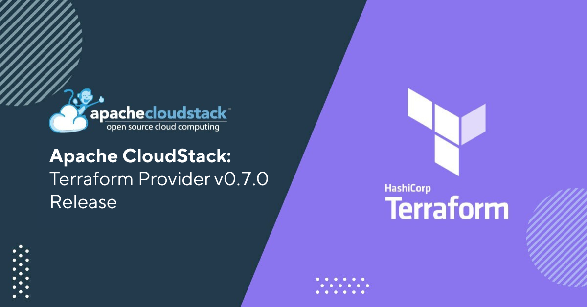

# Apache CloudStack Terraform Provider v0.7.0

The Apache CloudStack project is pleased to announce the release of CloudStack Terraform Provider v0.7.0.

Terraform is an open-source infrastructure-as-code software tool that provides a consistent CLI workflow for managing resources across multiple public/private clouds.

Apache CloudStack Terraform Provider v0.7.0 comes packed with several new features, enhancements, and bug fixes to make it even more robust and reliable.
Some of the highlights include:

<!-- truncate -->

- Added support for GPU - gpu_card and vgpu_profile data sources, and GPU on service offerings

- Added support for VPC offerings, with internet protocol and routing mode

- Added support for VPC internal load balancers

- Added support for role permissions (cloudstack_role_permission resource)

- Added support for Kubernetes cluster config data source

- Added support for security groups data source

- Added support for IPv6 in the cloudstack_network resource

- Added support for SystemVM offerings

- Added support for declarative storage network IP ranges

- Added support for delete protection on instances and disks

- Added support for Terraform import of several CloudStack resources

- Added support for requesting a specific IP address in cloudstack_ipaddress

- Added support for dest_cidr_list in egress firewall rules, and nexthop in static routes

- Added support for VR address on networks, and bypass_vlan_check / bypass_vlan_overlap_check parameters

- Added support for the "all" protocol option in security group rules, and optional CIDR for L2 networks

- Improved disk offering resource and data source

- Improved network offering update and read operations

- Improved Network ACL rules and private gateway ACL handling

- Improved pod and cluster data source filtering

- Deprecated the cloudstack_service_offering resource, replaced by cloudstack_service_offering_constrained, cloudstack_service_offering_unconstrained and cloudstack_service_offering_fixed

- Upgraded the CloudStack Go SDK to v2.19.1

- Various other bug fixes

Apache CloudStack Terraform Provider v0.7.0 is available for download now from the Apache CloudStack website.

## Downloads and Documentation

The official source code for Apache CloudStack Terraform Provider can be downloaded from:

https://github.com/apache/cloudstack-terraform-provider/releases/tag/v0.7.0

The installation and usage documentation for Apache CloudStack Terraform Provider is available at:

https://github.com/apache/cloudstack-terraform-provider/wiki

https://github.com/apache/cloudstack-terraform-provider/wiki#installing-from-github-release

Users can also get the provider from the Terraform registry published at:

https://registry.terraform.io/providers/cloudstack/cloudstack/0.7.0

The documentation for the usage of resources to create and interact with CloudStack is available at

https://registry.terraform.io/providers/cloudstack/cloudstack/latest/docs
