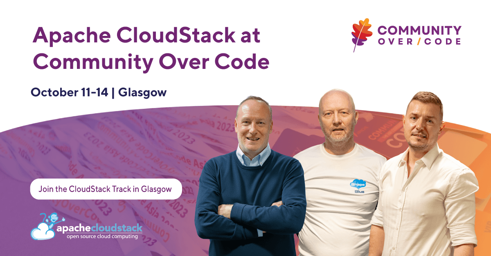

The Apache CloudStack community is heading to Glasgow this October for
Community Over Code 2026, the official open-source conference of The
Apache Software Foundation.

Taking place from 11–14 October 2026, Community Over Code brings together
developers, users, contributors and committers from across the Apache ecosystem
for four days of technical sessions, real-world experiences and open-source
collaboration. foster discussion, collaboration, and new ideas across projects.

<!-- truncate -->

## A Dedicated Apache CloudStack Track

Apache CloudStack will have its own dedicated track as part of this year’s
programme, bringing together members of the community to share technical
knowledge, practical experience and the latest developments around the project.

The CloudStack sessions on October 14th ,will explore topics from introduction
to Apache CloudStack to orchestrating GPU with cLoudStack, with speakers
sharing their experience from real-world environments and ongoing work within
the project.

Whether you are already running Apache CloudStack, contributing to the project
or simply interested in learning more about open-source cloud infrastructure,
the track is an opportunity to hear directly from the people working with
CloudStack every day.

## Meet the CloudStack Community in Glasgow

Community Over Code is about more than technical sessions. It provides an
opportunity for Apache communities to meet face-to-face, exchange ideas and
build new connections across projects.

Members of the Apache CloudStack community will be in Glasgow throughout the
event, so come along, join the sessions and meet the contributors, users and
organisations to help to move the project forward.

[Explore the agenda](https://web.cvent.com/event/ac71ce47-2b5f-424c-abfe-5b48255315fb/summary)

[Register for Community Over Code ](https://communityovercode.apache.org/events/glasgow-2026/register)
