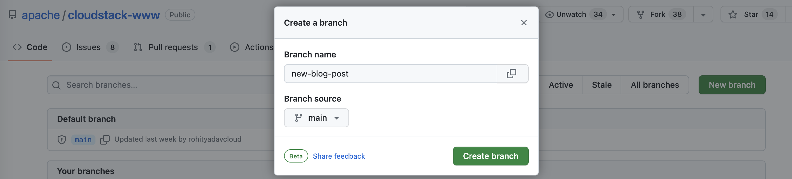
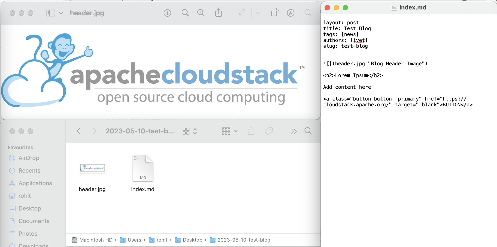
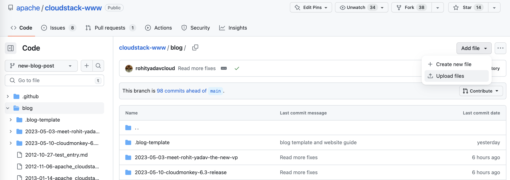
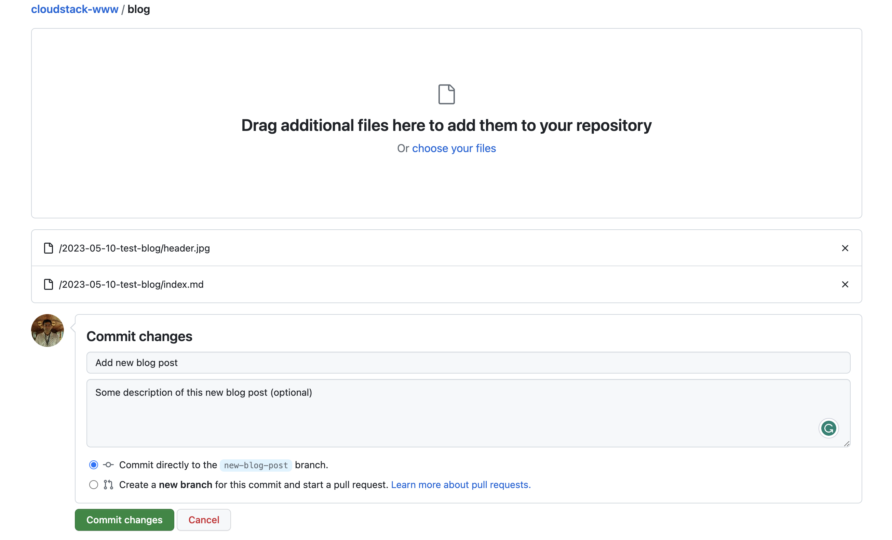
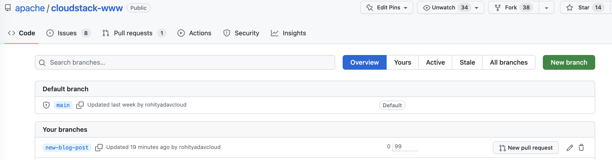
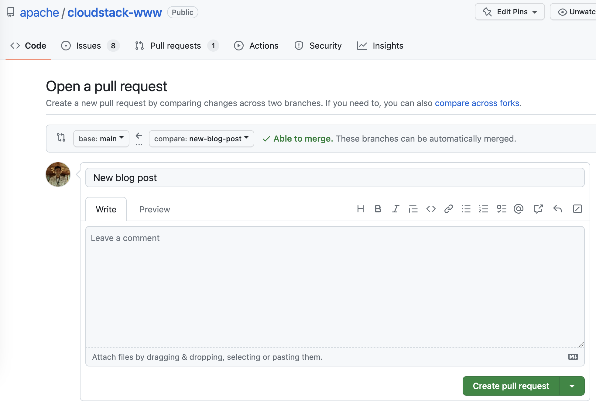
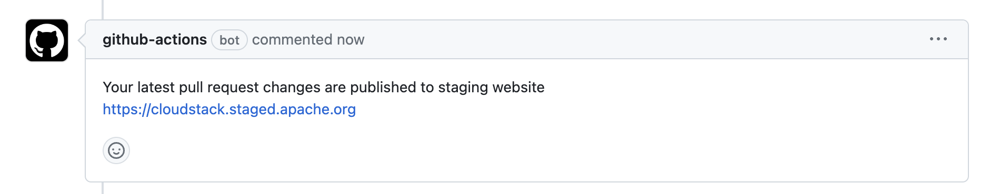
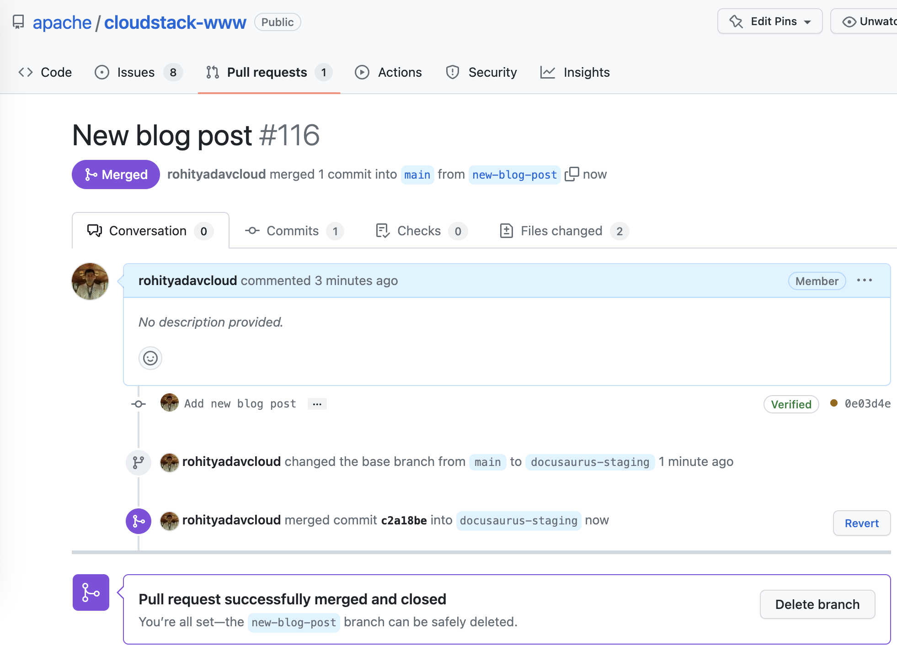
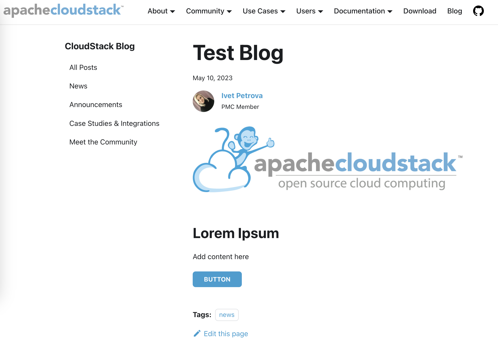

This is a website and blog development guide which can be used as a reference to
allow technical and non-technical contributors to work with the website for
adding/editing pages and blog posts.

Most of the pages and blog posts are written in Markdown, which is like a text
file usually ending with `.md` extension. These .md files are used by Docusaurus
(the static-site website framework) to generate HTML-based website so we don't
have to write HTML by manually.

You may co-relate with the source of this (Markdown) page at:
https://github.com/apache/cloudstack-www/blob/main/src/pages/website-guide.md

For basic Markdown syntax reference, please refer:
https://www.markdownguide.org/basic-syntax/

Refer to the following for Docusaurus supported markdown features:
https://docusaurus.io/docs/2.3.1/markdown-features

## Working with the Website, Pages and Blogs

### Website

Most of the website configuration such as theme, name, logos, menubar, footer
etc are configurable using the `docusaurus.config.js` that you can edit here:

https://github.com/apache/cloudstack-www/blob/main/docusaurus.config.js

### Pages

The various standalone pages are in this directory:

https://github.com/apache/cloudstack-www/tree/main/src/pages

Here you can use them as examples, on how to create MD or MDX file that build
as webpages. You can look at 'learn-more.md' as a reusable page that can be
included in other pages such as the homepage index.tsx, cloud-builders.mdx etc.

### Blog

To create a new blog, create a directory with naming convention
`YYYY-MM-DD-slug-url`. In this directory you can put in an `index.md` and other
assets such as images, pdfs etc. The .blog-template boilerplate can be used from
here:

https://github.com/apache/cloudstack-www/tree/main/blog/.blog-template

Use the provided index.md to specify attribute of your blog such as title, tags
(categories), authors and the slug (the permalink).

Having all your blog content and assets in a blog directory makes it easier to
work with GitHub's editor and allows you to visually contribute changes.

You may further read https://docusaurus.io/docs/blog for advance changes and
refer to the misc section on this page for various components that you case use.

A common use-case is to have a header file and a way to limit how much of the
post shows up on the blog roll. For this, to add read-more we can add a `<!--
truncate -->` in your blog post (the index.md file):

```
...blog content...
<!-- truncate -->
...blog content...
```

## Contributing Changes using GitHub

Once you've the boilerplate changes done, the steps are:

1. If you're a committer, you can edit directly the `main` branch or create a
GitHub branch (optionally in your personally fork) by heading to the
[branches](https://github.com/apache/cloudstack-www/branches) page:



2. You may edit any existing page in the `src/pages` directory or an existing
blog in the `blog` directory, or add new content. If you do this in
apache/cloudstack-www repository's `main` branch then creating a pull request
isn't required.

3. To add a new page or create a new blog you can also upload files, for example to
add a blog we can use the `.blog-template`, edit the `index.md` and add any
assets (such as images and pdfs) in a new directory on our computer (say
`2023-05-10-test-blog`):



4. Next, you can drag/drop or select this entire folder in the `blog` directory
of your newly created GitHub branch
(https://github.com/apache/cloudstack-www/tree/new-blog-post/blog):



And, click the commit button to upload the blog post:



5. Next, open a pull request to get your PR merged (this isn't required if
you directly make changes in the `main` branch). To do this, you go to the
branches list and click on the "New pull request" button that's in front of your
branch:



Next, create the pull request:



6. If you've opened a PR, a GitHub bot will notify you once it has built the
staging website for you to review your changes:



Your changes will be made live on the project website once a committer (or
yourself, if you're one) will merge the pull request: (pro-tip - try to always
delete your branch after merging)



If you're making changes directly on the `main` branch your changes will be made
live in a few minutes, for you to verify:



**That's it!**

## ToC on blog and website page

If you don't want table of contents show up on right-side of a page/blog, then
don't use the Markdown syntax for h2 (##), h3 (###) etc. instead use the HTML
`<h2>`, `<h3>` etc. which will not show the ToC on a page/blog.

Further reference: https://docusaurus.io/docs/2.3.1/markdown-features/toc

## Images

We can specify the path related to the `static/` directory paths, all files
in static folder are available from the root of the website such as:

```

```

Which results in:


Further reference: https://docusaurus.io/docs/2.3.1/markdown-features/assets

## Buttons

Here are some example for buttons, shapes and sizes which depends on the class
we use in the `<a>` tags. Note: for files within the website/blog source
folders, always use a target `_blank`.

For examples:

<a class="button button--primary button--sm" href="https://cloudstack.apache.org/" target="_blank">BUTTON</a>
<br/>
<br/>
<a class="button button--primary" href="https://cloudstack.apache.org/" target="_blank">BUTTON</a>
<br/>
<br/>
<a class="button button--primary button--lg" href="https://cloudstack.apache.org/" target="_blank">BUTTON</a>
<br/>
<br/>

Buttons can also have colours depending on the class used, such as:

<a class="button button--secondary" href="https://cloudstack.apache.org/" target="_blank">BUTTON</a>
<br/>
<a class="button button--info" href="https://cloudstack.apache.org/" target="_blank">BUTTON</a>
<br/>
<a class="button button--success" href="https://cloudstack.apache.org/" target="_blank">BUTTON</a>
<br/>
<a class="button button--warning" href="https://cloudstack.apache.org/" target="_blank">BUTTON</a>
<br/>
<a class="button button--danger" href="https://cloudstack.apache.org/" target="_blank">BUTTON</a>

## Code Blocks

Example of code block:

```
# dnf install cloudstack-management
```

## Using Admonitions

Refer to https://docusaurus.io/docs/2.3.1/markdown-features/admonitions


:::tip

Some **content** with _Markdown_ `syntax`. Check [this `link`](#).

:::

:::info

Some **content** with _Markdown_ `syntax`. Check [this `link`](#).

:::

## Other Examples

> This is a quote
>
> -By somebody

In this sentence, here is how you **bold**, *italics* or  ~~strike~~.

Here is a horizontal line:

***

Here is a list of things:
- Item1
- Item2
  - Item3
- Item4
  - Item 5
  - Item 5
    - Item 5
